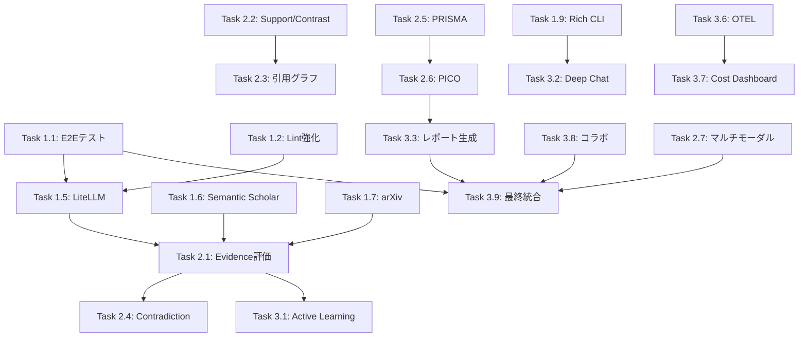

> Authority: ROADMAP (Level 5, Non-binding)

# JARVIS Research OS 開発計画書 v1.0

**作成日**: 2026-01-05  
**対象リポジトリ**: [kaneko-ai/jarvis-ml-pipeline](https://github.com/kaneko-ai/jarvis-ml-pipeline)  
**目標スコア**: 120/100点（業界トップ水準）  
**計画期間**: 24週間（6ヶ月）

---

## 目次

1. [概要](#概要)
2. [現状分析](#現状分析)
3. [競合比較](#競合比較)
4. [開発フェーズ](#開発フェーズ)
5. [タスク一覧](#タスク一覧)
6. [マイルストーン](#マイルストーン)
7. [依存関係](#依存関係)
8. [リソース見積](#リソース見積)

---

## 概要

### ビジョン

**「研究の再現性を保証する唯一のOSS」** として、学術研究支援AIツール市場でトップの地位を確立する。

### 戦略的ポジショニング

```
                    高い再現性・品質保証
                           ↑
                           │
        ┌──────────────────┼──────────────────┐
        │                  │                  │
        │    【空白領域】   │    JARVIS        │
        │    ここを狙う     │    目標位置      │
        │                  │     ★           │
商用SaaS ←─────────────────┼──────────────────→ OSS
        │                  │                  │
        │   Elicit        │    PaperQA2      │
        │   Consensus     │    ASReview      │
        │   scite         │                  │
        └──────────────────┼──────────────────┘
                           │
                           ↓
                    低い再現性・品質保証
```

### 差別化要因

| 要因 | JARVIS | Elicit | PaperQA2 | Rayyan |
|------|--------|--------|----------|--------|
| 品質ゲート4層 | ◎ | △ | △ | ○ |
| 仕様権威階層 | ◎ | ❌ | ❌ | ❌ |
| 10ファイルBundle契約 | ◎ | ❌ | ○ | ❌ |
| 完全OSS | ◎ | ❌ | ◎ | ❌ |
| PRISMA準拠 | △→◎ | △ | ❌ | ◎ |
| Evidence評価 | △→◎ | ◎ | ◎ | △ |

---

## 現状分析

### 現在スコア: 80.3/100点

| 評価項目 | 現在 | 目標 |
|---------|------|------|
| アーキテクチャ設計 | 88 | 100+ |
| コード品質 | 82 | 100+ |
| ドキュメント | 95 | 100+ |
| テスト・CI/CD | 78 | 100+ |
| セキュリティ | 75 | 100+ |
| 再現性・品質保証 | 90 | 100+ |
| ユーザビリティ | 72 | 100+ |
| 拡張性 | 85 | 100+ |
| 運用・監視 | 70 | 100+ |
| コミュニティ・OSS対応 | 68 | 100+ |

### 強み（維持・強化）

- SPEC_AUTHORITY.md による仕様権威階層
- 10ファイルBundle契約
- QualityGateVerifier 4層品質ゲート
- Pipeline as Config (YAML定義)
- Feedback Risk Model

### 弱み（改善対象）

- 論文DB規模（PubMedのみ→138M+論文）
- Evidence強度評価（未実装→scite相当）
- 引用ネットワーク可視化（未実装）
- Multi-LLM対応（限定的→全プロバイダ）
- 系統的レビュー対応（未実装→PRISMA準拠）

---

## 競合比較

### 機能マトリクス

| 機能 | JARVIS | Elicit | Consensus | PaperQA2 | scite |
|------|--------|--------|-----------|----------|-------|
| 論文DB規模 | PubMed | 138M | 220M | ユーザー提供 | 15億引用 |
| 要約生成 | ○ | ◎ | ◎ | ◎ | ○ |
| Evidence強度 | △ | ◎ | ◎ | ◎ | ◎ |
| 引用ネットワーク | ❌ | ○ | △ | △ | ◎ |
| Contradiction検出 | ❌ | △ | ○ | ◎ | ◎ |
| 品質ゲート | ◎ | △ | △ | △ | △ |
| オフライン動作 | ◎ | ❌ | ❌ | ◎ | ❌ |
| OSS | ◎ | ❌ | ❌ | ◎ | ❌ |
| 価格 | 無料 | $49/月 | $65/月 | 無料 | $20/月 |

---

## 開発フェーズ

### 全体構造

```
Phase 1: 基盤強化 (Week 1-8)
├── Sprint 1-2: テスト・品質基盤
├── Sprint 3-4: Multi-LLM・データソース統合
├── Sprint 5-6: CLI/UX改善
└── Sprint 7-8: ドキュメント・配布

Phase 2: 差別化機能 (Week 9-16)
├── Sprint 9-10: Evidence評価システム
├── Sprint 11-12: 引用分析・可視化
├── Sprint 13-14: 系統的レビュー対応
└── Sprint 15-16: マルチモーダル解析

Phase 3: 市場制覇 (Week 17-24)
├── Sprint 17-18: AI高度化
├── Sprint 19-20: レポート・統合
├── Sprint 21-22: 運用・監視
└── Sprint 23-24: コラボレーション・最終統合
```

### Phase別目標スコア

| Phase | 期間 | 目標スコア |
|-------|------|-----------|
| Phase 1完了 | Week 8 | 88/100 |
| Phase 2完了 | Week 16 | 103/100 |
| Phase 3完了 | Week 24 | 120/100 |

---

## タスク一覧

詳細は以下のファイルを参照:

- [Phase 1 タスク詳細](./tasks/PHASE1_TASKS.md)
- [Phase 2 タスク詳細](./tasks/PHASE2_TASKS.md)
- [Phase 3 タスク詳細](./tasks/PHASE3_TASKS.md)

### サマリー

| Phase | Task数 | SubTask数 | 推定工数 |
|-------|--------|-----------|---------|
| Phase 1 | 13 | 89 | 320h |
| Phase 2 | 7 | 57 | 280h |
| Phase 3 | 9 | 62 | 300h |
| **合計** | **29** | **208** | **900h** |

---

## マイルストーン

| ID | マイルストーン | 週 | 達成基準 |
|----|---------------|-----|---------|
| M1 | 基盤完成 | Week 8 | E2E通過、Multi-LLM対応、3データソース統合 |
| M2 | 差別化完成 | Week 16 | Evidence評価、引用分析、PRISMA対応 |
| M3 | v1.0リリース | Week 24 | 全機能統合、ドキュメント完備、PyPI公開 |

---

## 依存関係



---

## リソース見積

### 工数配分

| カテゴリ | 工数 | 割合 |
|---------|------|------|
| 実装 | 600h | 67% |
| テスト | 150h | 17% |
| ドキュメント | 100h | 11% |
| レビュー・調整 | 50h | 5% |

### 技術スタック追加

| 技術 | 用途 | Phase |
|------|------|-------|
| LiteLLM | Multi-LLM対応 | 1 |
| Rich/Typer | CLI改善 | 1 |
| NetworkX | 引用グラフ | 2 |
| OpenTelemetry | 可観測性 | 3 |
| FastAPI WebSocket | リアルタイム | 3 |

---

## 次のステップ

1. このドキュメントをチームでレビュー
2. [Phase 1 タスク](./tasks/PHASE1_TASKS.md) から着手
3. 週次で進捗を DECISIONS.md に記録
4. マイルストーン毎にスコア再評価

---

## 関連ドキュメント

- [SPEC_AUTHORITY.md](./SPEC_AUTHORITY.md) - 仕様権威階層
- [BUNDLE_CONTRACT.md](./BUNDLE_CONTRACT.md) - 成果物契約
- [DoD.md](./DoD.md) - 完了定義
- [DECISIONS.md](./DECISIONS.md) - 決定記録
