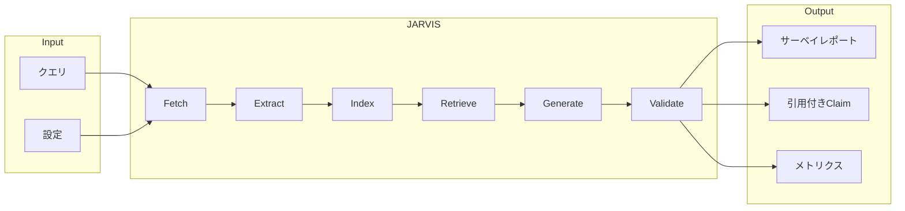
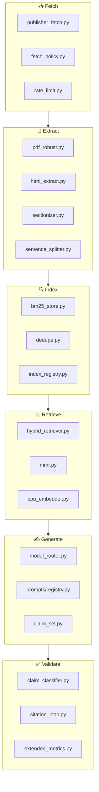
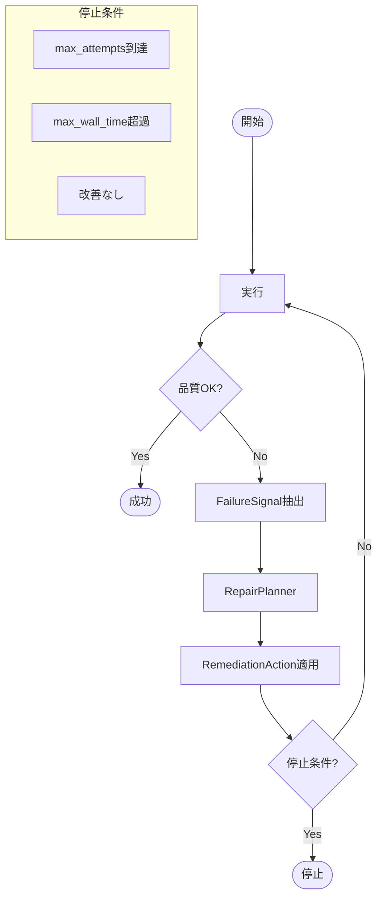
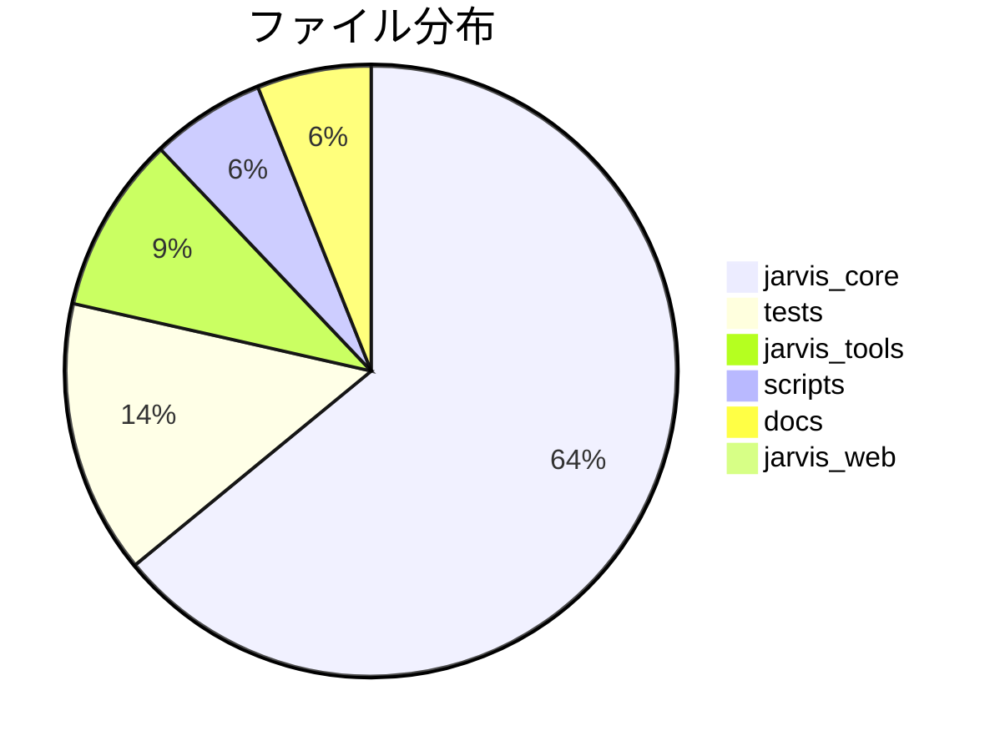
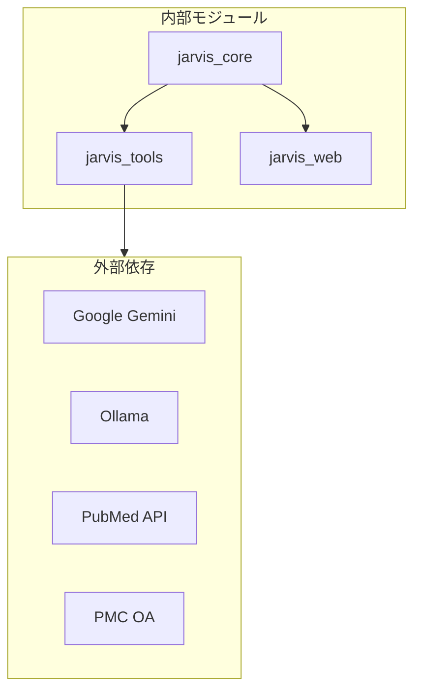
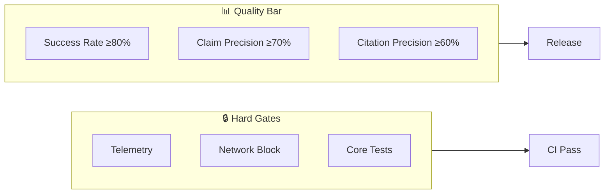
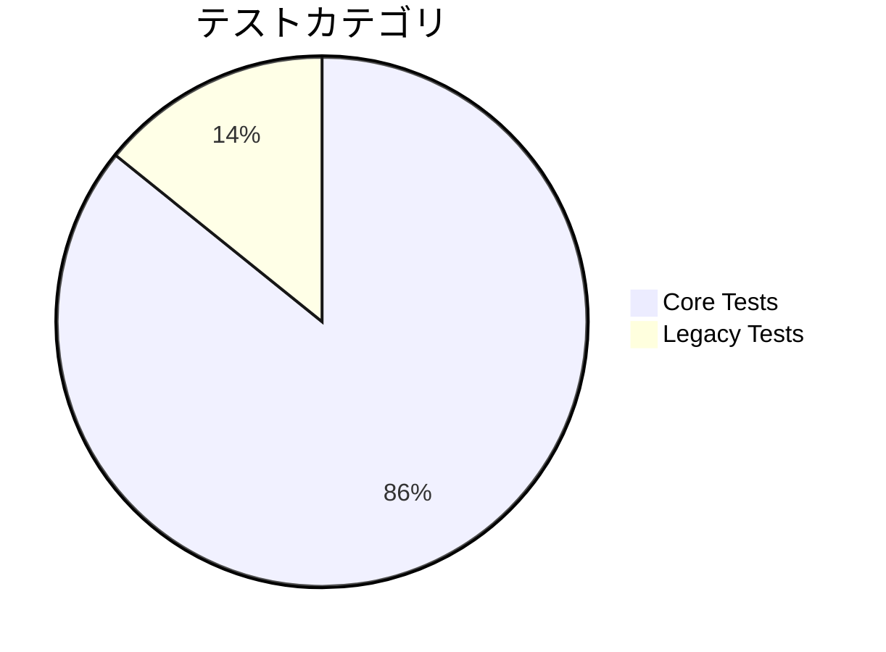
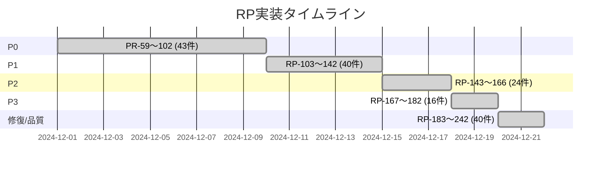

# JARVIS Research OS v1.0.0 アーキテクチャ分析

> Authority: REFERENCE (Level 2, Non-binding)


**生成日時**: 2026-02-08  
**バージョン**: v1.0.0  
**テスト状況**: Core Tests 127件全パス ✅

---

## 1. プロジェクト概要

JARVIS Research OSは、科学論文の自動サーベイ・知識合成を行うシステムです。



---

## 2. ディレクトリ構成

```
jarvis-ml-pipeline/
├── jarvis_core/        # コアライブラリ (212ファイル)
│   ├── runtime/        # 実行制御、修復ループ
│   ├── telemetry/      # ログ、トレース
│   ├── eval/           # 評価、品質測定
│   ├── storage/        # 永続化
│   ├── prompts/        # プロンプト管理
│   └── llm/            # LLM統合
│
├── jarvis_tools/       # ツール群 (31ファイル)
│   ├── papers/         # 論文取得・抽出
│   ├── embeddings/     # ベクトル化
│   ├── kg/             # 知識グラフ
│   └── http/           # HTTP・レート制限
│
├── jarvis_web/         # Web API (2ファイル)
│
├── scripts/            # 運用スクリプト (20ファイル)
│
├── tests/              # テスト (48ファイル)
│
└── docs/               # ドキュメント (20ファイル)
```

---

## 3. コンポーネント詳細

### 3.1 コアパイプライン



### 3.2 修復ループ（自動リカバリ）



**修復アクション一覧**:

| Action ID | 用途 | トリガー |
|-----------|------|----------|
| SWITCH_FETCH_ADAPTER | PDF取得失敗時 | FETCH_PDF_FAILED |
| INCREASE_TOP_K | 引用不足時 | CITATION_GATE_FAILED |
| TIGHTEN_MMR | 精度低下時 | LOW_CLAIM_PRECISION |
| CITATION_FIRST_PROMPT | 引用強化 | CITATION_GATE_FAILED |
| BUDGET_REBALANCE | 予算超過 | BUDGET_EXCEEDED |
| MODEL_ROUTER_SAFE_SWITCH | モデルエラー | MODEL_ERROR |

---

## 4. ファイル数統計



| カテゴリ | ファイル数 | 主要機能 |
|----------|-----------|----------|
| jarvis_core | 212 | コアロジック |
| tests | 48 | テスト |
| jarvis_tools | 31 | ツール |
| scripts | 20 | 運用 |
| docs | 20 | ドキュメント |
| jarvis_web | 2 | Web API |

---

## 5. 依存関係



**主要依存パッケージ**:
- `sentence-transformers` - 埋め込み
- `tiktoken` - トークン計算
- `pyyaml` - 設定
- `pytest` - テスト

---

## 6. 品質ゲート



| ゲート | 閾値 | 現状 |
|--------|------|------|
| Core Test Pass Rate | 100% | ✅ 127/127 |
| Success Rate | ≥ 80% | 🟡 未測定 |
| Claim Precision | ≥ 70% | 🟡 未測定 |
| Citation Precision | ≥ 60% | 🟡 未測定 |

---

## 7. テスト構成



**テストカテゴリ**:
- `@pytest.mark.core` - ブロッキング（必要パス）
- `@pytest.mark.legacy` - 非ブロッキング

---

## 8. 運用スクリプト

| スクリプト | RP | 用途 |
|------------|-----|------|
| `jarvis_doctor.py` | 164 | 環境診断 |
| `run_regression.py` | 203 | 回帰テスト |
| `check_quality_bar.py` | 204 | 品質バー確認 |
| `profile_run.py` | 223 | パフォーマンス分析 |
| `bench.py` | 232 | ベンチマーク |
| `scan_secrets.py` | 158 | シークレットスキャン |

---

## 9. 実装済みRP一覧



| 優先度 | RP範囲 | 件数 | 状況 |
|--------|--------|------|------|
| P0 | 59-102 | 43 | ✅ |
| P1 | 103-142 | 40 | ✅ |
| P2 | 143-166 | 24 | ✅ |
| P3 | 167-182 | 16 | ✅ |
| 修復/品質 | 183-242 | 40 | ✅ |
| **合計** | | **163** | ✅ |

---

## 10. 次のステップ

1. **回帰テスト実行**: `python scripts/run_regression.py`
2. **品質バー確認**: Success rate/Citation precision測定
3. **リリース準備**: `python scripts/generate_release_bundle.py`

---

## 11. 主要ドキュメント

| ドキュメント | 内容 |
|--------------|------|
| [INSTALL.md](./docs/INSTALL.md) | インストール手順 |
| [QUALITY_BAR.md](./docs/QUALITY_BAR.md) | 品質基準 |
| [REPAIR_POLICY.md](./docs/REPAIR_POLICY.md) | 修復ポリシー |
| [FETCH_POLICY.md](./docs/FETCH_POLICY.md) | 取得ポリシー |
| [RELEASE_NOTES_v4.3.md](./docs/RELEASE_NOTES_v4.3.md) | リリースノート |

