# JARVIS Research OS v4.3 アーキテクチャ分析

**生成日時**: 2024-12-22  
**バージョン**: v4.3  
**テスト状況**: Core Tests 127件全パス ✅

---

## 1. プロジェクト概要

JARVIS Research OSは、科学論文の自動サーベイ・知識合成を行うシステムです。

```mermaid
flowchart LR
    subgraph Input
        Q[クエリ]
        C[設定]
    end

    subgraph JARVIS
        F[Fetch] --> E[Extract]
        E --> I[Index]
        I --> R[Retrieve]
        R --> G[Generate]
        G --> V[Validate]
    end

    subgraph Output
        S[サーベイレポート]
        CL[引用付きClaim]
        M[メトリクス]
    end

    Q --> F
    C --> F
    V --> S
    V --> CL
    V --> M
```



---

## 2. ディレクトリ構成

```
jarvis-ml-pipeline/
├── jarvis_core/        # コアライブラリ (212ファイル)
│   ├── runtime/        # 実行制御、修復ループ
│   ├── telemetry/      # ログ、トレース
│   ├── eval/           # 評価、品質測定
│   ├── storage/        # 永続化
│   ├── prompts/        # プロンプト管理
│   └── llm/            # LLM統合
│
├── jarvis_tools/       # ツール群 (31ファイル)
│   ├── papers/         # 論文取得・抽出
│   ├── embeddings/     # ベクトル化
│   ├── kg/             # 知識グラフ
│   └── http/           # HTTP・レート制限
│
├── jarvis_web/         # Web API (2ファイル)
│
├── scripts/            # 運用スクリプト (20ファイル)
│
├── tests/              # テスト (48ファイル)
│
└── docs/               # ドキュメント (20ファイル)
```

---

## 3. コンポーネント詳細

### 3.1 コアパイプライン

```mermaid
flowchart TB
    subgraph Fetch["📥 Fetch"]
        PF[publisher_fetch.py]
        FP[fetch_policy.py]
        RL[rate_limit.py]
    end

    subgraph Extract["📄 Extract"]
        PDF[pdf_robust.py]
        HTML[html_extract.py]
        SEC[sectionizer.py]
        SS[sentence_splitter.py]
    end

    subgraph Index["🔍 Index"]
        BM25[bm25_store.py]
        DD[dedupe.py]
        IR[index_registry.py]
    end

    subgraph Retrieve["📊 Retrieve"]
        HR[hybrid_retriever.py]
        MMR[mmr.py]
        EMB[cpu_embedder.py]
    end

    subgraph Generate["✍️ Generate"]
        MR[model_router.py]
        PR[prompts/registry.py]
        CS[claim_set.py]
    end

    subgraph Validate["✅ Validate"]
        CC[claim_classifier.py]
        CL[citation_loop.py]
        EM[extended_metrics.py]
    end

    Fetch --> Extract --> Index --> Retrieve --> Generate --> Validate
```



### 3.2 修復ループ（自動リカバリ）

```mermaid
flowchart TD
    Start([開始]) --> Run[実行]
    Run --> Quality{品質OK?}
    Quality -->|Yes| Success([成功])
    Quality -->|No| Signal[FailureSignal抽出]
    Signal --> Plan[RepairPlanner]
    Plan --> Action[RemediationAction適用]
    Action --> Check{停止条件?}
    Check -->|No| Run
    Check -->|Yes| Stop([停止])

    subgraph StopConditions["停止条件"]
        MA[max_attempts到達]
        WT[max_wall_time超過]
        NI[改善なし]
    end
```



**修復アクション一覧**:

| Action ID | 用途 | トリガー |
|-----------|------|----------|
| SWITCH_FETCH_ADAPTER | PDF取得失敗時 | FETCH_PDF_FAILED |
| INCREASE_TOP_K | 引用不足時 | CITATION_GATE_FAILED |
| TIGHTEN_MMR | 精度低下時 | LOW_CLAIM_PRECISION |
| CITATION_FIRST_PROMPT | 引用強化 | CITATION_GATE_FAILED |
| BUDGET_REBALANCE | 予算超過 | BUDGET_EXCEEDED |
| MODEL_ROUTER_SAFE_SWITCH | モデルエラー | MODEL_ERROR |

---

## 4. ファイル数統計

```mermaid
pie title ファイル分布
    "jarvis_core" : 212
    "tests" : 48
    "jarvis_tools" : 31
    "scripts" : 20
    "docs" : 20
    "jarvis_web" : 2
```



| カテゴリ | ファイル数 | 主要機能 |
|----------|-----------|----------|
| jarvis_core | 212 | コアロジック |
| tests | 48 | テスト |
| jarvis_tools | 31 | ツール |
| scripts | 20 | 運用 |
| docs | 20 | ドキュメント |
| jarvis_web | 2 | Web API |

---

## 5. 依存関係

```mermaid
flowchart TB
    subgraph External["外部依存"]
        Gemini[Google Gemini]
        Ollama[Ollama]
        PubMed[PubMed API]
        PMC[PMC OA]
    end

    subgraph Internal["内部モジュール"]
        Core[jarvis_core]
        Tools[jarvis_tools]
        Web[jarvis_web]
    end

    Core --> Tools
    Core --> Web
    Tools --> External
```



**主要依存パッケージ**:
- `sentence-transformers` - 埋め込み
- `tiktoken` - トークン計算
- `pyyaml` - 設定
- `pytest` - テスト

---

## 6. 品質ゲート

```mermaid
flowchart LR
    subgraph HardGates["🔒 Hard Gates"]
        T[Telemetry]
        N[Network Block]
        CT[Core Tests]
    end

    subgraph QualityBar["📊 Quality Bar"]
        SR[Success Rate ≥80%]
        CP[Claim Precision ≥70%]
        CIT[Citation Precision ≥60%]
    end

    HardGates --> CI[CI Pass]
    QualityBar --> Release[Release]
```



| ゲート | 閾値 | 現状 |
|--------|------|------|
| Core Test Pass Rate | 100% | ✅ 127/127 |
| Success Rate | ≥ 80% | 🟡 未測定 |
| Claim Precision | ≥ 70% | 🟡 未測定 |
| Citation Precision | ≥ 60% | 🟡 未測定 |

---

## 7. テスト構成

```mermaid
pie title テストカテゴリ
    "Core Tests" : 127
    "Legacy Tests" : 21
```



**テストカテゴリ**:
- `@pytest.mark.core` - ブロッキング（必須パス）
- `@pytest.mark.legacy` - 非ブロッキング

---

## 8. 運用スクリプト

| スクリプト | RP | 用途 |
|------------|-----|------|
| `jarvis_doctor.py` | 164 | 環境診断 |
| `run_regression.py` | 203 | 回帰テスト |
| `check_quality_bar.py` | 204 | 品質バー確認 |
| `profile_run.py` | 223 | パフォーマンス分析 |
| `bench.py` | 232 | ベンチマーク |
| `scan_secrets.py` | 158 | シークレットスキャン |

---

## 9. 実装済みRP一覧

```mermaid
gantt
    title RP実装タイムライン
    dateFormat  YYYY-MM-DD
    section P0
    PR-59〜102 (43件)       :done, 2024-12-01, 2024-12-10
    section P1
    RP-103〜142 (40件)      :done, 2024-12-10, 2024-12-15
    section P2
    RP-143〜166 (24件)      :done, 2024-12-15, 2024-12-18
    section P3
    RP-167〜182 (16件)      :done, 2024-12-18, 2024-12-20
    section 修復/品質
    RP-183〜242 (40件)      :done, 2024-12-20, 2024-12-22
```



| 優先度 | RP範囲 | 件数 | 状況 |
|--------|--------|------|------|
| P0 | 59-102 | 43 | ✅ |
| P1 | 103-142 | 40 | ✅ |
| P2 | 143-166 | 24 | ✅ |
| P3 | 167-182 | 16 | ✅ |
| 修復/品質 | 183-242 | 40 | ✅ |
| **合計** | | **163** | ✅ |

---

## 10. 次のステップ

1. **回帰テスト実行**: `python scripts/run_regression.py`
2. **品質バー確認**: Success rate/Citation precision測定
3. **リリース準備**: `python scripts/generate_release_bundle.py`

---

## 11. 主要ドキュメント

| ドキュメント | 内容 |
|--------------|------|
| [INSTALL.md](./docs/INSTALL.md) | インストール手順 |
| [QUALITY_BAR.md](./docs/QUALITY_BAR.md) | 品質基準 |
| [REPAIR_POLICY.md](./docs/REPAIR_POLICY.md) | 修復ポリシー |
| [FETCH_POLICY.md](./docs/FETCH_POLICY.md) | 取得ポリシー |
| [RELEASE_NOTES_v4.3.md](./docs/RELEASE_NOTES_v4.3.md) | リリースノート |
