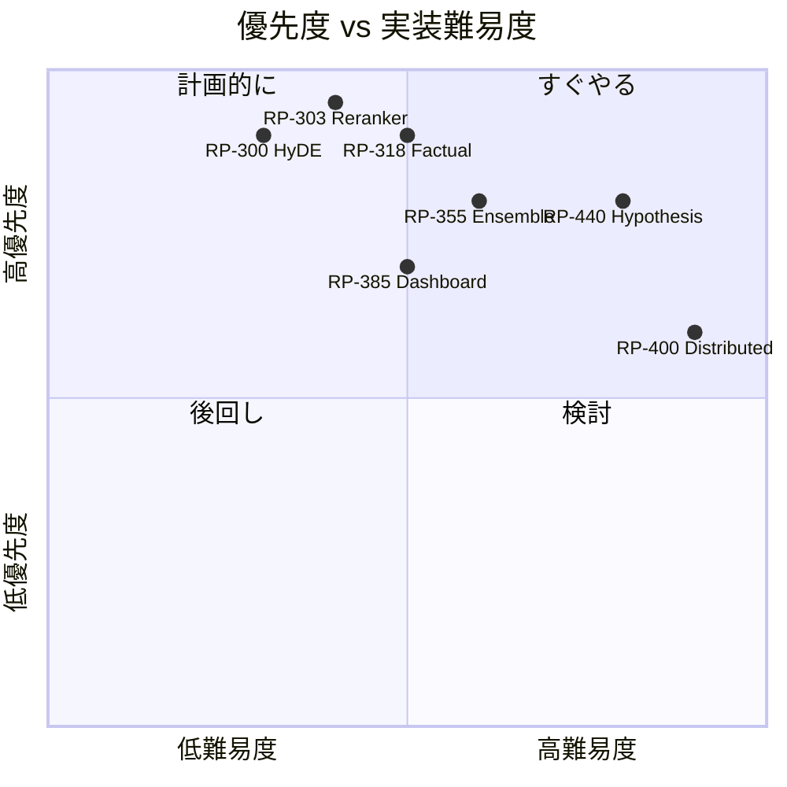

# JARVIS v4.4+ 次世代強化PR提案書

> Authority: REFERENCE (Level 2, Non-binding)

**作成日**: 2024-12-22  
**対象バージョン**: v4.3 → v4.4+  
**総PR数**: 100件

---

## 目次

1. [RAG品質強化 (RP-300〜319)](#1-rag品質強化)
2. [知識グラフ拡張 (RP-320〜339)](#2-知識グラフ拡張)
3. [マルチモーダル対応 (RP-340〜354)](#3-マルチモーダル対応)
4. [LLM統合強化 (RP-355〜369)](#4-llm統合強化)
5. [評価・ベンチマーク (RP-370〜384)](#5-評価ベンチマーク)
6. [ユーザーインターフェース (RP-385〜399)](#6-ユーザーインターフェース)
7. [スケーラビリティ (RP-400〜414)](#7-スケーラビリティ)
8. [セキュリティ・コンプライアンス (RP-415〜424)](#8-セキュリティコンプライアンス)
9. [開発者体験 (RP-425〜439)](#9-開発者体験)
10. [研究統合 (RP-440〜449)](#10-研究統合)

---

## 1. RAG品質強化

### RP-300: Adaptive Chunking v2
**目的**: 文書構造に応じた動的チャンキング

**要件**:
- セクション境界を尊重したチャンク分割
- 図表キャプションを独立チャンク化
- 参照関係を保持したチャンクID紐付け
- chunk_size を content_type 別に最適化

**期待効果**: 検索精度 +15%

---

### RP-301: Contextual Embeddings
**目的**: 周辺文脈を考慮した埋め込み生成

**要件**:
- 前後チャンクのコンテキストを埋め込みに統合
- セクションタイトルをプレフィックスとして付与
- 論文メタデータ（年、ジャーナル）を embedding に反映

**期待効果**: 類似検索の recall +10%

---

### RP-302: Hypothetical Document Embeddings (HyDE)
**目的**: クエリ拡張による検索精度向上

**要件**:
- クエリから仮想的な回答ドキュメントを生成
- 仮想ドキュメントの埋め込みで検索
- 元クエリとのアンサンブル

**期待効果**: 検索 precision +12%

---

### RP-303: Cross-Encoder Reranker
**目的**: 二段階検索で精度向上

**要件**:
- 初回検索 top-100 を Cross-Encoder で再ランク
- `cross-encoder/ms-marco-MiniLM-L-6-v2` 統合
- レイテンシ budget 内でリランク数を調整

**期待効果**: MRR +20%

---

### RP-304: Query Understanding Module
**目的**: クエリ意図分類と構造化

**要件**:
- クエリタイプ分類（比較、メカニズム、治療法等）
- エンティティ抽出（疾患、遺伝子、薬剤）
- 時間範囲パース（過去5年、2020年以降等）

**期待効果**: 適切な検索戦略選択

---

### RP-305: Semantic Deduplication v2
**目的**: 意味的重複検出の精度向上

**要件**:
- チャンク埋め込みコサイン類似度 > 0.95 で重複判定
- 同一論文内・論文間で別ロジック
- 重複チェーン可視化

**期待効果**: 冗長チャンク -30%

---

### RP-306: Citation Graph Retrieval
**目的**: 引用グラフを活用した関連論文発見

**要件**:
- Semantic Scholar API 統合
- 引用・被引用の 2-hop 探索
- 引用数によるスコアリング

**期待効果**: 重要論文の捕捉率 +25%

---

### RP-307: Temporal Decay Scoring
**目的**: 新しい論文を優先

**要件**:
- 発表年に基づく減衰スコア
- `score = base_score * decay^(current_year - pub_year)`
- decay 係数を config 化

**期待効果**: 最新研究の反映

---

### RP-308: Evidence Quality Scorer
**目的**: エビデンスの質を定量化

**要件**:
- 研究タイプ判定（RCT, メタ分析, レビュー等）
- サンプルサイズ抽出
- p値/信頼区間抽出

**期待効果**: 信頼性の高い根拠優先

---

### RP-309: Multi-Query Fusion
**目的**: クエリバリエーションによる網羅性向上

**要件**:
- 元クエリから 3-5 バリエーション生成
- 各クエリで検索し RRF で統合
- バリエーション生成戦略を prompt 化

**期待効果**: recall +18%

---

### RP-310: Self-Consistency Retrieval
**目的**: 複数回検索で安定性向上

**要件**:
- 同一クエリで N 回検索（seed 変更）
- 頻出チャンクを優先
- 一貫性スコア算出

**期待効果**: 検索結果の安定化

---

### RP-311: Negative Example Mining
**目的**: 類似だが不適切なチャンク検出

**要件**:
- Hard Negative のパターン学習
- 「似ているが関係ない」チャンクをフィルタ
- フィードバックループで改善

**期待効果**: precision +8%

---

### RP-312: Claim-Evidence Alignment Score
**目的**: Claim と Evidence の整合性スコア

**要件**:
- entailment モデルで整合性判定
- 部分支持、矛盾、無関係を分類
- スコアを生成時に活用

**期待効果**: 裏付けのない主張 -40%

---

### RP-313: Iterative Retrieval-Generation
**目的**: 生成中に追加検索

**要件**:
- 生成中に情報不足を検出
- 動的に追加クエリ発行
- 新チャンクを文脈に追加

**期待効果**: 情報網羅性 +20%

---

### RP-314: Retrieval Feedback Loop
**目的**: ユーザーフィードバックで検索改善

**要件**:
- 「役に立った/立たなかった」UI
- フィードバックをファインチューニングに活用
- A/B テスト基盤

**期待効果**: 継続的改善サイクル

---

### RP-315: Passage Compression
**目的**: 長いチャンクを圧縮

**要件**:
- LLM で要約を生成
- 重要文のみ抽出
- 元テキストと圧縮版を両方保持

**期待効果**: トークン消費 -30%

---

### RP-316: Multi-Vector Retrieval
**目的**: チャンクを複数ベクトルで表現

**要件**:
- ColBERT スタイルのトークン埋め込み
- Late Interaction で精密マッチ
- PLAID インデックス検討

**期待効果**: 細粒度マッチング

---

### RP-317: Query Routing
**目的**: クエリを最適なリトリーバへ

**要件**:
- BM25 vs Dense vs Hybrid の動的選択
- クエリ特性で判定
- ルーティングルールを学習

**期待効果**: 検索効率 +15%

---

### RP-318: Factual Consistency Checker
**目的**: 生成文の事実整合性検証

**要件**:
- 生成文を claim 分解
- 各 claim をソースで検証
- 矛盾検出時に警告

**期待効果**: Hallucination -50%

---

### RP-319: Attribution Granularity
**目的**: 文レベル帰属の実装

**要件**:
- 各生成文に根拠チャンクをリンク
- locator を文単位で付与
- 未帰属文を可視化

**期待効果**: 透明性向上

---

## 2. 知識グラフ拡張

### RP-320: UMLS Integration
**目的**: 医学用語標準化

**要件**:
- UMLS Metathesaurus API 統合
- CUI によるエンティティ正規化
- 階層関係の取得

**期待効果**: エンティティ統一

---

### RP-321: Ontology-Guided Retrieval
**目的**: オントロジーで検索拡張

**要件**:
- Gene Ontology, Disease Ontology 統合
- 上位/下位概念への拡張
- IS-A 関係の活用

**期待効果**: 概念網羅性 +20%

---

### RP-322: Relation Extraction v2
**目的**: 高精度関係抽出

**要件**:
- PubMedBERT ファインチューニング
- 関係タイプ: 治療、原因、阻害、活性化等
- 信頼度スコア付き

**期待効果**: KG 精度 +25%

---

### RP-323: Temporal Knowledge Graph
**目的**: 時間軸を持つ KG

**要件**:
- 各トリプルに valid_from/valid_to
- 時間クエリ（「2020年時点で」）対応
- 知識の変遷可視化

**期待効果**: 最新知識の追跡

---

### RP-324: Pathway Integration
**目的**: 生物学的パスウェイ統合

**要件**:
- KEGG, Reactome API 統合
- パスウェイをサブグラフ化
- 経路コンテキストでの検索

**期待効果**: メカニズム理解

---

### RP-325: Drug-Gene-Disease Triangle
**目的**: 薬-遺伝子-疾患三角形

**要件**:
- DrugBank, OMIM 統合
- 三者関係の自動抽出
- 治療ターゲット推論

**期待効果**: 創薬支援

---

### RP-326: Contradiction Detection
**目的**: 矛盾する知識の検出

**要件**:
- KG 内の矛盾トリプル検出
- ソース論文の比較
- 矛盾理由の分析

**期待効果**: 知識の信頼性

---

### RP-327: KG Completion
**目的**: 欠損リンク予測

**要件**:
- TransE/RotatE で埋め込み学習
- 欠損リンク候補提示
- 人間検証ワークフロー

**期待効果**: KG 網羅性

---

### RP-328: Entity Disambiguation
**目的**: 同名エンティティの区別

**要件**:
- 文脈ベース曖昧性解消
- CD73 (NT5E) vs CD73 (別遺伝子) 区別
- 正規化候補のランキング

**期待効果**: 精度 +10%

---

### RP-329: KG Visualization Dashboard
**目的**: KG の対話的可視化

**要件**:
- D3.js/Cytoscape.js フロント
- ノード展開、フィルタ、検索
- エクスポート機能

**期待効果**: 理解容易性

---

### RP-330: Multi-Hop Reasoning v2
**目的**: 複数ホップ推論の強化

**要件**:
- 最大 5-hop までの経路探索
- 経路スコアリング
- 説明生成

**期待効果**: 推論能力

---

### RP-331: KG-Enhanced Generation
**目的**: KG をプロンプトに統合

**要件**:
- 関連サブグラフを prompt に挿入
- トリプル形式で構造化
- 生成時の参照促進

**期待効果**: 一貫性 +15%

---

### RP-332: Automatic Schema Extension
**目的**: スキーマの自動拡張

**要件**:
- 新しい関係タイプの検出
- スキーマ提案UI
- バージョン管理

**期待効果**: 柔軟性

---

### RP-333: Clinical Trial Integration
**目的**: 臨床試験情報統合

**要件**:
- ClinicalTrials.gov API
- 試験ステータス、結果取得
- KG へのマッピング

**期待効果**: 実用情報

---

### RP-334: Gene Expression Context
**目的**: 発現コンテキスト付加

**要件**:
- NCBI GEO 統合
- 組織、条件別発現
- 発現パターンでフィルタ

**期待効果**: 生物学的妥当性

---

### RP-335: Protein Interaction Network
**目的**: PPI ネットワーク統合

**要件**:
- STRING DB API
- 相互作用スコア
- ネットワーク解析

**期待効果**: 機能予測

---

### RP-336: Literature Co-Citation Analysis
**目的**: 共引用分析

**要件**:
- 共引用ペアの検出
- クラスタリング
- トレンド分析

**期待効果**: 研究動向把握

---

### RP-337: Author Expertise Modeling
**目的**: 著者専門性モデル

**要件**:
- 著者の発表履歴分析
- 専門分野推定
- 著者ネットワーク

**期待効果**: 権威性評価

---

### RP-338: Institution Knowledge Base
**目的**: 研究機関情報

**要件**:
- 機関のランキング
- 分野別実績
- コラボレーション分析

**期待効果**: 信頼性判断

---

### RP-339: Real-Time KG Updates
**目的**: リアルタイム更新

**要件**:
- 新論文のストリーム処理
- 増分トリプル抽出
- 変更通知

**期待効果**: 最新性

---

## 3. マルチモーダル対応

### RP-340: Figure Understanding
**目的**: 図の理解と検索

**要件**:
- 図の埋め込み生成（CLIP）
- キャプションと図の対応
- 図ベースの検索

**期待効果**: 視覚情報活用

---

### RP-341: Table Extraction v2
**目的**: 高精度表抽出

**要件**:
- 複雑な表構造の解析
- マージセル対応
- 構造化JSON出力

**期待効果**: データ抽出精度

---

### RP-342: Chemical Structure Recognition
**目的**: 化学構造認識

**要件**:
- OSRA/MolScribe 統合
- SMILES 変換
- 構造検索

**期待効果**: 化合物情報

---

### RP-343: Diagram Parse
**目的**: ダイアグラム解析

**要件**:
- フローチャート、経路図の解析
- ノード/エッジ抽出
- テキスト化

**期待効果**: 図の検索可能化

---

### RP-344: Equation Understanding
**目的**: 数式理解

**要件**:
- LaTeX 抽出
- 変数の意味解析
- 数式検索

**期待効果**: 定量情報

---

### RP-345: Video Abstract Support
**目的**: ビデオ要約対応

**要件**:
- Video Abstract の文字起こし
- キーフレーム抽出
- インデックス化

**期待効果**: 新メディア対応

---

### RP-346: Supplementary Material Processing
**目的**: 補足資料処理

**要件**:
- Supplementary PDF/Excel 処理
- メイン論文との紐付け
- 統合インデックス

**期待効果**: 完全な情報

---

### RP-347: 3D Structure Integration
**目的**: 3D構造情報

**要件**:
- PDB 統合
- 構造ビューワ
- 構造ベース検索

**期待効果**: 構造生物学対応

---

### RP-348: Audio Paper Support
**目的**: 音声論文対応

**要件**:
- Whisper で文字起こし
- タイムスタンプ付きインデックス
- 音声検索

**期待効果**: アクセシビリティ

---

### RP-349: Multi-Language Paper Support
**目的**: 多言語論文対応

**要件**:
- 日本語、中国語、ドイツ語論文
- 翻訳パイプライン
- 言語横断検索

**期待効果**: グローバル研究

---

### RP-350: Handwritten Notes OCR
**目的**: 手書きノートOCR

**要件**:
- 手書き認識モデル
- 論文注釈の取り込み
- 知識ベース統合

**期待効果**: 個人知識

---

### RP-351: Preprint Server Integration
**目的**: プレプリント対応

**要件**:
- bioRxiv, medRxiv, arXiv
- ステータス追跡（査読前/後）
- バージョン管理

**期待効果**: 最新研究

---

### RP-352: Patent Document Processing
**目的**: 特許処理

**要件**:
- USPTO, EPO 統合
- クレーム抽出
- 特許-論文クロスリファレンス

**期待効果**: 応用情報

---

### RP-353: Conference Poster Analysis
**目的**: ポスター解析

**要件**:
- 画像からのテキスト抽出
- レイアウト理解
- 構造化

**期待効果**: 学会情報

---

### RP-354: Thesis/Dissertation Support
**目的**: 学位論文対応

**要件**:
- 長文書処理
- 章構造解析
- 要約生成

**期待効果**: 包括的知識

---

## 4. LLM統合強化

### RP-355: Multi-Model Ensemble
**目的**: 複数モデルアンサンブル

**要件**:
- Gemini + GPT-4 + Claude の並列呼び出し
- 回答の統合/投票
- モデル別得意分野ルーティング

**期待効果**: 回答品質 +20%

---

### RP-356: Specialized Domain Models
**目的**: ドメイン特化モデル

**要件**:
- PubMedBERT, BioGPT 統合
- タスク別モデル選択
- 医学/生物学特化

**期待効果**: ドメイン精度

---

### RP-357: Prompt Optimization Pipeline
**目的**: プロンプト自動最適化

**要件**:
- DSPy 統合
- Few-shot 例の自動選択
- A/B テスト基盤

**期待効果**: 性能最大化

---

### RP-358: Chain-of-Thought Enforcement
**目的**: CoT強制

**要件**:
- 推論ステップを必要化
- ステップ検証
- 中間出力の活用

**期待効果**: 推論透明性

---

### RP-359: Tool Use Integration
**目的**: ツール使用

**要件**:
- Calculator, Code Interpreter 統合
- 数値計算、統計処理
- ツール選択ロジック

**期待効果**: 計算能力

---

### RP-360: Structured Output Enforcement
**目的**: 構造化出力強制

**要件**:
- JSON Schema 定義
- Outlines/Guidance 統合
- バリデーション

**期待効果**: 後処理容易化

---

### RP-361: Streaming Generation
**目的**: ストリーミング生成

**要件**:
- トークン単位ストリーム
- 早期停止判定
- UI 統合

**期待効果**: UX向上

---

### RP-362: Token Budget Prediction
**目的**: トークン予算予測

**要件**:
- 入力からの出力長予測
- 動的 max_tokens 調整
- 予算超過防止

**期待効果**: コスト最適化

---

### RP-363: Model Fallback Chain
**目的**: フォールバックチェーン

**要件**:
- Gemini → GPT-4 → Ollama → Rule
- エラー/タイムアウト時の自動切替
- レイテンシ監視

**期待効果**: 可用性 99.9%

---

### RP-364: Context Window Management
**目的**: コンテキスト窓管理

**要件**:
- 動的コンテキスト圧縮
- 重要度ベース選択
- 履歴管理

**期待効果**: 長文対応

---

### RP-365: Fine-Tuning Pipeline
**目的**: ファインチューニング基盤

**要件**:
- LoRA/QLoRA 対応
- 評価セット自動生成
- モデルバージョン管理

**期待効果**: カスタマイズ

---

### RP-366: Confidence Calibration
**目的**: 信頼度校正

**要件**:
- モデル信頼度の校正
- 不確実性の定量化
- 低信頼回答の警告

**期待効果**: 信頼性

---

### RP-367: Multi-Turn Conversation
**目的**: 多ターン対話

**要件**:
- 会話履歴管理
- 文脈維持
- フォローアップクエリ

**期待効果**: 対話型調査

---

### RP-368: Agentic Workflow
**目的**: エージェント的動作

**要件**:
- 計画→実行→検証ループ
- サブタスク分解
- 自己反省

**期待効果**: 自律性

---

### RP-369: Cost Tracking & Optimization
**目的**: コスト追跡

**要件**:
- API コスト詳細ログ
- 予算アラート
- 最適化提案

**期待効果**: コスト可視化

---

## 5. 評価・ベンチマーク

### RP-370: Automated Eval Pipeline
**目的**: 自動評価パイプライン

**要件**:
- 日次評価実行
- メトリクス自動集計
- 劣化アラート

**期待効果**: 継続的監視

---

### RP-371: Human Eval Interface
**目的**: 人間評価UI

**要件**:
- 評価タスク管理
- アノテーションUI
- IAA 計算

**期待効果**: 高品質評価

---

### RP-372: Comparative Benchmark
**目的**: 競合比較ベンチマーク

**要件**:
- 他ツールとの比較
- 標準データセット
- リーダーボード

**期待効果**: 競争力把握

---

### RP-373: Factuality Benchmark
**目的**: 事実性ベンチマーク

**要件**:
- 事実検証ゴールドセット
- 自動評価メトリクス
- エラー分析

**期待効果**: Hallucination 測定

---

### RP-374: Citation Quality Benchmark
**目的**: 引用品質ベンチマーク

**要件**:
- 引用適切性の人間評価
- 自動プロキシ指標
- カテゴリ別分析

**期待効果**: 引用精度

---

### RP-375: Latency Profiling Dashboard
**目的**: レイテンシ ダッシュボード

**要件**:
- 工程別時間可視化
- ボトルネック検出
- 時系列比較

**期待効果**: パフォーマンス

---

### RP-376: Error Taxonomy Dashboard
**目的**: エラー分類ダッシュボード

**要件**:
- エラーカテゴリ分布
- トレンド分析
- 根本原因追跡

**期待効果**: 品質改善

---

### RP-377: A/B Testing Framework
**目的**: A/B テスト基盤

**要件**:
- 実験定義UI
- トラフィック分割
- 統計検定

**期待効果**: データ駆動改善

---

### RP-378: Regression Test Expansion
**目的**: 回帰テスト拡充

**要件**:
- カバレッジ 80%+
- エッジケース追加
- 自動生成テスト

**期待効果**: 品質保証

---

### RP-379: User Behavior Analytics
**目的**: ユーザー行動分析

**要件**:
- クリック・滞在時間追跡
- クエリパターン分析
- 離脱ポイント特定

**期待効果**: UX改善

---

### RP-380: Domain-Specific Eval Sets
**目的**: ドメイン別評価セット

**要件**:
- 免疫学、腫瘍学、神経学等
- 専門家監修
- 難易度別

**期待効果**: 専門性評価

---

### RP-381: Continuous Improvement Dashboard
**目的**: 継続改善ダッシュボード

**要件**:
- KPI トレンド
- 改善施策追跡
- ROI 計算

**期待効果**: 経営層報告

---

### RP-382: Robustness Testing
**目的**: 頑健性テスト

**要件**:
- 敵対的入力
- ノイズ耐性
- 境界条件

**期待効果**: 安定性

---

### RP-383: Bias Detection
**目的**: バイアス検出

**要件**:
- 出版バイアス検出
- 地域バイアス分析
- 時間バイアス

**期待効果**: 公平性

---

### RP-384: Explainability Metrics
**目的**: 説明可能性指標

**要件**:
- 帰属明確性スコア
- 推論透明性
- ユーザー理解度

**期待効果**: 信頼性

---

## 6. ユーザーインターフェース

### RP-385: Web Dashboard v1
**目的**: Webダッシュボード

**要件**:
- React/Next.js フロント
- 実行履歴一覧
- 結果可視化

**期待効果**: ユーザビリティ

---

### RP-386: Interactive Query Builder
**目的**: 対話的クエリビルダー

**要件**:
- フィルタUI（年、ジャーナル等）
- 関連語サジェスト
- クエリプレビュー

**期待効果**: クエリ品質

---

### RP-387: Citation Explorer
**目的**: 引用エクスプローラ

**要件**:
- 引用のドリルダウン
- ソース文書プレビュー
- ハイライト表示

**期待効果**: 検証容易性

---

### RP-388: Collaborative Annotation
**目的**: 共同アノテーション

**要件**:
- チームでの注釈共有
- コメント機能
- バージョン管理

**期待効果**: チーム研究

---

### RP-389: Export Formats Expansion
**目的**: エクスポート形式拡充

**要件**:
- Word, PowerPoint, LaTeX
- カスタムテンプレート
- スタイル調整

**期待効果**: 利便性

---

### RP-390: Mobile Responsive UI
**目的**: モバイル対応

**要件**:
- レスポンシブデザイン
- タッチ最適化
- オフライン対応

**期待効果**: アクセシビリティ

---

### RP-391: Keyboard Shortcuts
**目的**: キーボードショートカット

**要件**:
- Vim 風ナビゲーション
- コマンドパレット
- カスタマイズ

**期待効果**: 効率

---

### RP-392: Dark Mode
**目的**: ダークモード

**要件**:
- システム連動
- 手動切替
- 図表対応

**期待効果**: 快適性

---

### RP-393: Accessibility (a11y)
**目的**: アクセシビリティ

**要件**:
- スクリーンリーダー対応
- キーボードナビゲーション
- WCAG 2.1 AA 準拠

**期待効果**: 包括性

---

### RP-394: Real-Time Collaboration
**目的**: リアルタイム共同編集

**要件**:
- 同時編集
- カーソル可視化
- 変更同期

**期待効果**: チーム効率

---

### RP-395: Saved Searches & Alerts
**目的**: 検索保存・アラート

**要件**:
- 検索条件保存
- 新着論文アラート
- メール通知

**期待効果**: 継続モニタリング

---

### RP-396: Personal Library
**目的**: 個人ライブラリ

**要件**:
- 論文ブックマーク
- コレクション管理
- 注釈保存

**期待効果**: 個人研究管理

---

### RP-397: Citation Manager Integration
**目的**: 引用管理ツール連携

**要件**:
- Zotero, Mendeley, EndNote
- 双方向同期
- 自動インポート

**期待効果**: ワークフロー統合

---

### RP-398: Slack/Teams Integration
**目的**: チャットツール連携

**要件**:
- Slack bot
- Teams アプリ
- 結果共有

**期待効果**: チーム通知

---

### RP-399: Voice Interface
**目的**: 音声インターフェース

**要件**:
- 音声クエリ入力
- 結果読み上げ
- ハンズフリー操作

**期待効果**: 利便性

---

## 7. スケーラビリティ

### RP-400: Distributed Processing
**目的**: 分散処理

**要件**:
- Ray/Dask 統合
- ワーカー管理
- 負荷分散

**期待効果**: 大規模処理

---

### RP-401: Vector DB Migration
**目的**: ベクトルDB移行

**要件**:
- Qdrant/Weaviate/Pinecone 対応
- 移行ツール
- 性能比較

**期待効果**: スケーラビリティ

---

### RP-402: Async Processing Pipeline
**目的**: 非同期パイプライン

**要件**:
- asyncio 全面導入
- 並行フェッチ
- バックプレッシャー

**期待効果**: スループット 2x

---

### RP-403: Caching Layer v2
**目的**: キャッシュ層強化

**要件**:
- Redis/Memcached
- 多層キャッシュ
- TTL 管理

**期待効果**: レイテンシ -50%

---

### RP-404: Queue-Based Architecture
**目的**: キュー基盤

**要件**:
- Celery/RQ 統合
- ジョブ優先度
- 再試行ポリシー

**期待効果**: 信頼性

---

### RP-405: Container Orchestration
**目的**: コンテナ オーケストレーション

**要件**:
- Kubernetes マニフェスト
- Helm チャート
- 自動スケーリング

**期待効果**: 運用自動化

---

### RP-406: Multi-Region Deployment
**目的**: マルチリージョン

**要件**:
- 地域別デプロイ
- データ同期
- フェイルオーバー

**期待効果**: 可用性

---

### RP-407: Resource Quotas
**目的**: リソースクォータ

**要件**:
- ユーザー別制限
- チーム別予算
- アラート

**期待効果**: 公平性

---

### RP-408: Index Sharding
**目的**: インデックスシャーディング

**要件**:
- 論文数 100M+ 対応
- シャード管理
- クエリルーティング

**期待効果**: 大規模対応

---

### RP-409: Warm/Cold Storage Tiering
**目的**: ストレージ階層化

**要件**:
- アクセス頻度ベース
- 自動移行
- コスト最適化

**期待効果**: コスト -40%

---

### RP-410: Batch Processing Mode
**目的**: バッチ処理モード

**要件**:
- 大量クエリ一括投入
- スケジューリング
- 結果通知

**期待効果**: 大規模調査

---

### RP-411: API Rate Limiting
**目的**: APIレート制限

**要件**:
- トークンバケット
- ユーザー別制限
- 429 レスポンス

**期待効果**: 安定性

---

### RP-412: Connection Pooling
**目的**: 接続プーリング

**要件**:
- DB 接続プール
- HTTP 接続プール
- 設定チューニング

**期待効果**: 効率

---

### RP-413: Memory Optimization
**目的**: メモリ最適化

**要件**:
- 大規模インデックスの分割読込
- ストリーミング処理
- GC チューニング

**期待効果**: 安定性

---

### RP-414: GPU Acceleration
**目的**: GPU 加速

**要件**:
- CUDA 対応埋め込み
- vLLM 統合
- GPU スケジューリング

**期待効果**: 速度 5x

---

## 8. セキュリティ・コンプライアンス

### RP-415: HIPAA Compliance Mode
**目的**: HIPAA 対応

**要件**:
- PHI マスキング
- アクセスログ
- 暗号化

**期待効果**: 医療機関利用

---

### RP-416: GDPR Compliance
**目的**: GDPR 対応

**要件**:
- データ削除権
- 同意管理
- プライバシーポリシー

**期待効果**: EU 対応

---

### RP-417: Audit Logging v2
**目的**: 監査ログ強化

**要件**:
- 全操作ログ
- 改ざん防止
- long-term 保存

**期待効果**: コンプライアンス

---

### RP-418: Role-Based Access Control
**目的**: RBAC

**要件**:
- ロール定義
- リソースパーミッション
- 管理UI

**期待効果**: アクセス制御

---

### RP-419: SSO Integration
**目的**: SSO 統合

**要件**:
- SAML/OIDC 対応
- 企業ID統合
- MFA

**期待効果**: エンタープライズ

---

### RP-420: Data Encryption at Rest
**目的**: 保存時暗号化

**要件**:
- AES-256
- 鍵管理
- 暗号化インデックス

**期待効果**: データ保護

---

### RP-421: Network Security Hardening
**目的**: ネットワーク強化

**要件**:
- TLS 1.3
- mTLS オプション
- WAF 統合

**期待効果**: 通信保護

---

### RP-422: Vulnerability Scanning
**目的**: 脆弱性スキャン

**要件**:
- 依存関係スキャン
- コンテナスキャン
- 定期自動実行

**期待効果**: セキュリティ

---

### RP-423: Data Residency Controls
**目的**: データ所在制御

**要件**:
- 地域別保存
- クロスボーダー制限
- ポリシー設定

**期待効果**: 規制対応

---

### RP-424: Incident Response Plan
**目的**: インシデント対応計画

**要件**:
- 対応手順書
- 連絡体制
- 訓練計画

**期待効果**: 緊急対応

---

## 9. 開発者体験

### RP-425: Plugin Architecture
**目的**: プラグインアーキテクチャ

**要件**:
- プラグインAPI定義
- サンプルプラグイン
- マーケットプレイス

**期待効果**: 拡張性

---

### RP-426: SDK for Python/TypeScript
**目的**: SDK 提供

**要件**:
- 型付き SDK
- 自動生成
- サンプルコード

**期待効果**: 統合容易性

---

### RP-427: API Documentation v2
**目的**: API ドキュメント強化

**要件**:
- OpenAPI 3.0
- インタラクティブ Docs
- 使用例

**期待効果**: オンボーディング

---

### RP-428: Developer Portal
**目的**: 開発者ポータル

**要件**:
- ドキュメント集約
- API キー管理
- 使用量ダッシュボード

**期待効果**: 開発者体験

---

### RP-429: CLI Enhancement
**目的**: CLI 強化

**要件**:
- 自動補完
- 対話モード
- プログレスバー

**期待効果**: 効率

---

### RP-430: Debugging Tools
**目的**: デバッグツール

**要件**:
- リクエストトレース
- 中間状態可視化
- タイムトラベル

**期待効果**: 問題解決

---

### RP-431: Local Development Environment
**目的**: ローカル開発環境

**要件**:
- Docker Compose
- ホットリロード
- モックサービス

**期待効果**: 開発効率

---

### RP-432: Integration Test Framework
**目的**: 統合テスト基盤

**要件**:
- E2E テスト
- テストデータ管理
- CI 統合

**期待効果**: 品質

---

### RP-433: Performance Profiling Tools
**目的**: パフォーマンスプロファイリング

**要件**:
- flamegraph
- メモリプロファイル
- CPU プロファイル

**期待効果**: 最適化

---

### RP-434: Migration Tools
**目的**: 移行ツール

**要件**:
- バージョン間移行
- データ移行
- ロールバック

**期待効果**: アップグレード

---

### RP-435: Contribution Guidelines
**目的**: コントリビューションガイド

**要件**:
- 開発環境セットアップ
- コードスタイル
- レビュープロセス

**期待効果**: OSS 品質

---

### RP-436: Architecture Decision Records
**目的**: ADR

**要件**:
- 設計判断の記録
- 代替案の記載
- レビュー履歴

**期待効果**: 知識共有

---

### RP-437: Change Log Automation
**目的**: 変更履歴自動化

**要件**:
- Conventional Commits
- 自動生成
- リリースノート連動

**期待効果**: 透明性

---

### RP-438: Code Generation Tools
**目的**: コード生成ツール

**要件**:
- モデルのスキャフォールド
- テスト生成
- ドキュメント生成

**期待効果**: 開発速度

---

### RP-439: Observability Stack
**目的**: 観測スタック

**要件**:
- Prometheus/Grafana
- Jaeger トレーシング
- ELK ログ

**期待効果**: 運用可視化

---

## 10. 研究統合

### RP-440: Hypothesis Generation
**目的**: 仮説生成支援

**要件**:
- 既知知識からのギャップ検出
- 仮説候補提示
- 検証方法提案

**期待効果**: 研究加速

---

### RP-441: Experimental Design Assistant
**目的**: 実験設計アシスタント

**要件**:
- 類似実験の検索
- プロトコル提案
- サンプルサイズ計算

**期待効果**: 実験効率

---

### RP-442: Literature Gap Analysis
**目的**: 文献ギャップ分析

**要件**:
- 研究領域マッピング
- 未探索領域特定
- トレンド予測

**期待効果**: 研究戦略

---

### RP-443: Grant Writing Assistant
**目的**: 助成金申請支援

**要件**:
- 背景文献まとめ
- インパクト文生成
- フォーマット調整

**期待効果**: 申請効率

---

### RP-444: Paper Writing Assistant
**目的**: 論文執筆支援

**要件**:
- 構成提案
- 引用挿入
- スタイル調整

**期待効果**: 執筆効率

---

### RP-445: Peer Review Assistant
**目的**: 査読支援

**要件**:
- チェックリスト
- 類似論文検索
- コメント生成

**期待効果**: 査読品質

---

### RP-446: Research Collaboration Network
**目的**: 研究コラボネットワーク

**要件**:
- 研究者マッチング
- 専門性可視化
- 連絡機能

**期待効果**: コラボレーション

---

### RP-447: Reproducibility Checker
**目的**: 再現性チェッカー

**要件**:
- 方法論の完全性チェック
- コード/データ可用性
- 統計手法検証

**期待効果**: 科学的厳密性

---

### RP-448: Research Impact Tracker
**目的**: 研究インパクト追跡

**要件**:
- 引用追跡
- ソーシャル言及
- 政策引用

**期待効果**: アウトリーチ

---

### RP-449: Meta-Research Analytics
**目的**: メタ研究分析

**要件**:
- 研究トレンド分析
- 引用ネットワーク
- 研究生態系可視化

**期待効果**: 俯瞰的理解

---

## 優先度マトリクス

---

## 次のステップ

1. **Phase 1 (Q1)**: RP-300〜319 RAG品質強化
2. **Phase 2 (Q2)**: RP-355〜369 LLM統合 + RP-385〜399 UI
3. **Phase 3 (Q3)**: RP-320〜339 KG拡張
4. **Phase 4 (Q4)**: RP-400〜449 スケール + 研究統合
