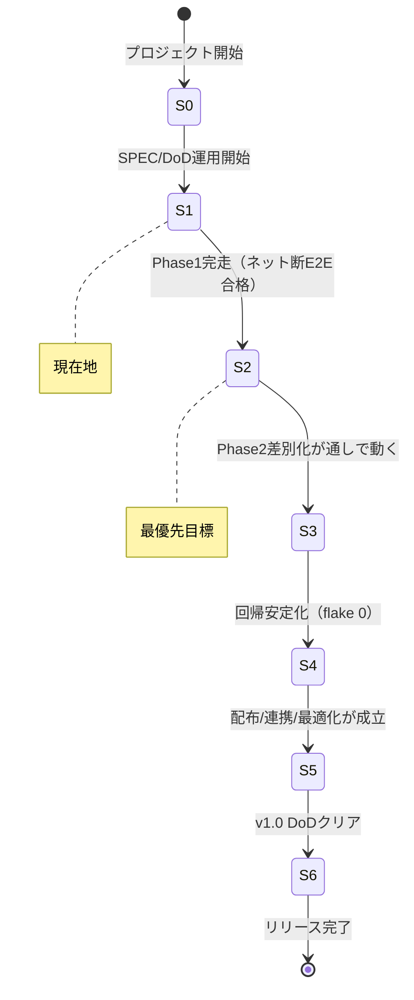
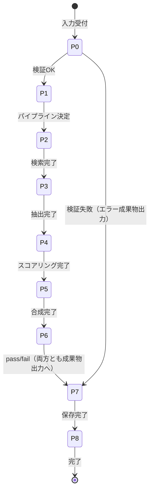
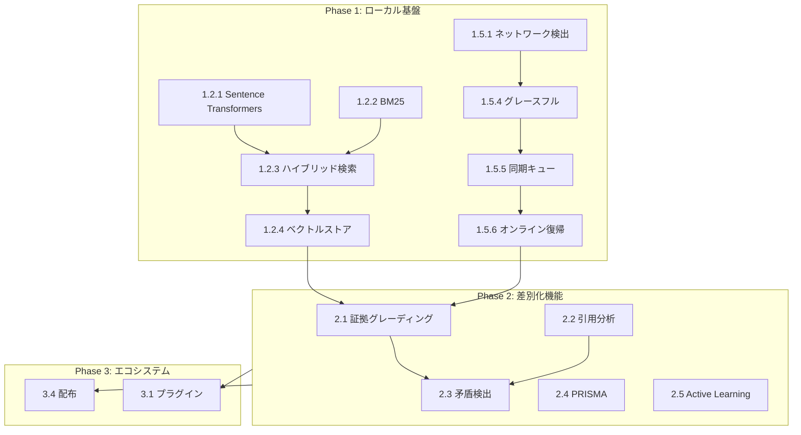

---

# ブラッシュアップ版：JAVIS 状態遷移・現状評価・完遂ロードマップ

以下は、構造・可読性の改善、内容の精緻化、運用面の強化、技術的な補強を全て反映した完全版です。

```markdown
# JARVIS Research OS - 統合運用ドキュメント v2.0

> **Authority**: SPEC (Level 1, Binding)  
> **最終更新**: 2026-01-27  
> **リポジトリ**: https://github.com/kaneko-ai/jarvis-ml-pipeline

---

## 目次

1. [概要と目的](#1-概要と目的)
2. [ドキュメント階層と権威レベル](#2-ドキュメント階層と権威レベル)
3. [現状分析（Fact）](#3-現状分析fact)
4. [ステートマシン：開発成熟度](#4-ステートマシン開発成熟度)
5. [ステートマシン：実行パイプライン](#5-ステートマシン実行パイプライン)
6. [評価軸と合格条件](#6-評価軸と合格条件)
7. [カバレッジ運用ポリシー](#7-カバレッジ運用ポリシー)
8. [Daily Coverage Snapshot](#8-daily-coverage-snapshot)
9. [タスク全列挙と依存関係](#9-タスク全列挙と依存関係)
10. [実装ファイル一式](#10-実装ファイル一式)
11. [運用チェックリスト](#11-運用チェックリスト)
12. [リスク管理](#12-リスク管理)
13. [クイックリファレンス](#13-クイックリファレンス)

---

## 1. 概要と目的

### 1.1 本ドキュメントの目的

本ドキュメントは、JARVIS Research OSの開発における「現在地」と「目的地」を明確にし、その間を埋めるための具体的な実行計画と品質ゲートを定義する。

### 1.2 解決すべき課題

開発において以下のパターンが繰り返されると、プロジェクトは完成しない。

**アンチパターン1: 完走前の積み上げ**
Phase 1が未完のままPhase 2/3の機能を追加し続けると、未完了タスクが指数関数的に増加する。

**アンチパターン2: 品質ゲートの形骸化**
カバレッジやテストの閾値を「通すため」に下げると、品質が保証されなくなる。

**アンチパターン3: 継続観測の欠如**
定期的な計測なしでは、劣化に気づくのが遅れる。

### 1.3 本ドキュメントで解決する方法

状態遷移の明確化によって「今どこにいるか」を常に把握可能にする。検証可能な合格条件により「次に進んでよいか」を客観的に判断できるようにする。Daily Coverage Snapshotで「品質が維持されているか」を毎日確認する。タスクの依存関係可視化により「何から着手すべきか」を明確にする。

---

## 2. ドキュメント階層と権威レベル

### 2.1 権威レベル定義

| Level | 名称 | 拘束力 | 例 |
|-------|------|--------|-----|
| L1 | SPEC | Binding（拘束） | 本ドキュメント、COVERAGE_POLICY.md |
| L2 | DoD | Binding | Definition of Done、品質ゲート |
| L3 | DECISION | Semi-binding | DECISIONS.md（決定事項） |
| L4 | REFERENCE | Non-binding | 改善履歴、チュートリアル |
| L5 | ROADMAP | Non-binding | 完遂計画書、Sprint計画 |

### 2.2 一次情報（参照すべきファイル）

本ドキュメントの記述と以下のファイルに矛盾がある場合、以下を優先する。

| ファイル | 内容 | 権威 |
|----------|------|------|
| `docs/COVERAGE_POLICY.md` | カバレッジ2段階ゲート | L1 |
| `.coveragerc.phase1` | Phase 1設定（85%、branch無効） | L1 |
| `.coveragerc.phase2` | Phase 2設定（95%、branch有効） | L1 |
| `scripts/ci_coverage.sh` | カバレッジ計測の一元スクリプト | L1 |
| `.github/workflows/ci.yml` | CI定義 | L2 |
| `docs/JARVIS_COMPLETION_PLAN_v3.md` | ロードマップ・残タスク | L5 |

---

## 3. 現状分析（Fact）

### 3.1 プロジェクト概況

| 指標 | 値 | 備考 |
|------|-----|------|
| 作成日 | 2026-01-06 | 完遂計画書v3.0 |
| 現在達成率 | 47.2% | 875/1000点 = 87.5点 |
| 目標 | 120点 | 1200/1000点 |
| 残り期間 | 12週間 | Sprint 13-24 |
| 残りタスク | 29タスク / 156サブタスク | |
| 残り工数 | 約507時間 | |

### 3.2 マイルストーン

```
現在 ──▶ M1.5 ──▶ M2 ──▶ M2.5 ──▶ M3
47.2%    92点     102点   112点    120点
         Week2    Week6   Week10   Week12
```

| マイルストーン | 週 | 達成基準 | スコア |
|---------------|-----|---------|--------|
| M1.5 | Week 2 | Phase 1完了（オフライン基本動作） | 92点 |
| M2 | Week 6 | 差別化機能MVP（証拠グレーディング動作） | 102点 |
| M2.5 | Week 10 | Phase 2完了（全差別化機能動作） | 112点 |
| M3 | Week 12 | v1.0リリース（PyPI公開） | 120点 |

### 3.3 Phase別残タスク詳細

**Phase 1（残り32% / 102h）** はローカル/オフライン基盤の完成を目指す。

ローカルLLM（残り15%）では、既存コード置換完了が残り30%、モデル管理CLIが未着手。

ローカル埋め込み（残り60%）では、Sentence Transformers統合が残り50%、BM25スパース埋め込みが未着手、ハイブリッド検索が未着手、ベクトルストア改良が残り80%、既存埋め込み置換が残り70%。

キャッシュ（残り20%）では、FTS5専用モジュールが残り40%、キャッシュ管理CLIが未着手。

無料API（残り25%）では、arXivクライアントが残り70%、Crossref/Unpaywallが残り80%。

オフラインモード（残り50%）では、ネットワーク検出が残り70%、オフライン設定が残り60%、CLIオプションが未着手、グレースフルデグラデーションが残り50%、同期キューが未着手、オンライン復帰同期が未着手。

**Phase 2（残り80% / 224h）** は差別化機能の実装を担う。証拠グレーディングが残り75%、引用分析が残り85%、矛盾検出が残り90%、PRISMAが残り85%、Active Learningが残り70%。

**Phase 3（残り85% / 255h）** はエコシステム構築を担う。プラグインが残り90%、外部連携が残り95%、ドキュメントが残り60%、配布が残り70%、最適化が残り80%。

---

## 4. ステートマシン：開発成熟度

### 4.1 状態定義

| 状態 | 名称 | 説明 | 主要成果物 |
|------|------|------|------------|
| S0 | 仕様権威の固定 | SPEC/DoD/DecisionLogが運用の唯一根拠 | docs/SPEC.md |
| S1 | 実行契約の固定 | 成果物契約・品質ゲートが常時稼働 | CI/CD設定 |
| S2 | Phase 1完了 | ローカル/オフライン基本動作が完走 | jarvis run --offline |
| S3 | Phase 2 MVP | 差別化機能がパイプラインに統合され実働 | 証拠グレーディング |
| S4 | Phase 2完了 | 差別化機能が回帰安定 | 全Phase 2機能 |
| S5 | Phase 3完了 | 配布・連携・最適化が成立 | PyPI/Docker |
| S6 | v1.0 Release | 120点・運用基準クリア | リリースタグ |

### 4.2 遷移図



### 4.3 現在の状態

**現在地: S1（実行契約の固定）**

S2（Phase 1完了）への遷移条件を満たすには以下が必要である。

| 条件ID | 条件 | 現状 | 残作業 |
|--------|------|------|--------|
| S2-01 | ネット断でE2E完走 | 未達成 | オフラインモード実装 |
| S2-02 | 成果物契約充足 | 部分達成 | 契約テスト追加 |
| S2-03 | 同期キュー動作 | 未着手 | sync/ モジュール実装 |
| S2-04 | import/CLI副作用ゼロ | 達成 | - |
| S2-05 | 回帰テストCI固定 | 達成 | - |

---

## 5. ステートマシン：実行パイプライン

### 5.1 パイプライン状態

| 状態 | 名称 | 説明 |
|------|------|------|
| P0 | Input検証 | task/goal/constraintsの正規化 |
| P1 | Pipeline選択 | canonical/offline/mvp |
| P2 | Retrieval | オンライン/オフライン戦略選択 |
| P3 | Extraction | claim/evidence/locator抽出 |
| P4 | Scoring | features→rank |
| P5 | Synthesis | answer + citations生成 |
| P6 | QualityGate | 断定/根拠/引用/形式チェック |
| P7 | RunStore | 成果物出力（常に実行） |
| P8 | UI/API | 表示（読み取り専用） |

### 5.2 遷移図



### 5.3 重要な設計原則

**原則1: 成果物は常に出力する**
P6（QualityGate）でfailしても、P7（RunStore）は必ず実行する。失敗の記録も成果物である。

**原則2: オフラインでも完走する**
P2（Retrieval）はオフライン戦略を持ち、ネットワーク断でもP7まで到達可能でなければならない。

---

## 6. 評価軸と合格条件

### 6.1 評価軸（Rubric）

| 軸 | 説明 | 計測方法 |
|-----|------|----------|
| 仕様統治 | SPEC/DoDが運用されているか | ドキュメントレビュー |
| 実行契約 | 成果物契約が満たされるか | 契約テスト |
| テスト品質 | テストカバレッジ・flake率 | CI結果 |
| セキュリティ | 脆弱性スキャン結果 | safety/bandit |
| 運用性 | ログ・監視・復旧手順 | 手順書確認 |
| オフライン完走性 | ネット断でE2E通過 | E2Eテスト |
| 入口堅牢性 | import/CLI起動で副作用なし | 単体テスト |

### 6.2 S2（Phase 1完了）の合格条件

以下の全条件を満たすことでS2への遷移が承認される。

| AC ID | 条件 | 検証方法 | 合格基準 |
|-------|------|----------|----------|
| AC-S2-01 | ネット断でP0→P7完走 | `pytest tests/e2e/test_offline.py` | 全テストpass |
| AC-S2-02 | 成功/失敗両方で成果物契約充足 | `pytest tests/contract/` | 全テストpass |
| AC-S2-03 | 同期キュー基本動作 | `pytest tests/sync/test_queue.py` | enqueue/dequeue動作 |
| AC-S2-04 | import副作用ゼロ | `python -c "import jarvis_core"` | 0.5秒以内、出力なし |
| AC-S2-05 | 回帰テストCI固定 | CI履歴 | 直近10回flake 0 |
| AC-S2-06 | カバレッジ85%以上 | `scripts/ci_coverage.sh` | Phase 1 gate pass |

### 6.3 M2（差別化機能MVP）の合格条件

| AC ID | 条件 | 検証方法 | 合格基準 |
|-------|------|----------|----------|
| AC-M2-01 | 証拠グレーディング精度 | Golden test set | 85%以上 |
| AC-M2-02 | Support/Contrast分類動作 | `pytest tests/citation/` | 全テストpass |
| AC-M2-03 | PRISMA SVG出力 | `jarvis prisma --output test.svg` | 有効なSVG生成 |
| AC-M2-04 | スコア102点以上 | スコアリングスクリプト | 102点以上 |

---

## 7. カバレッジ運用ポリシー

### 7.1 2段階ゲート方式

**Phase 1ゲート（現在適用中）**

| 項目 | 値 |
|------|-----|
| 評価対象 | Statement/Line のみ |
| Branch評価 | 無効 |
| しきい値 | 85% |
| 設定ファイル | `.coveragerc.phase1` |

**Phase 2ゲート（将来）**

| 項目 | 値 |
|------|-----|
| 評価対象 | Statement/Line + Branch |
| Branch評価 | 有効 |
| しきい値 | 95% |
| 設定ファイル | `.coveragerc.phase2` |

### 7.2 計測コマンド

```bash
# Phase 1（デフォルト）
COVERAGE_PHASE=1 bash scripts/ci_coverage.sh

# Phase 2
COVERAGE_PHASE=2 bash scripts/ci_coverage.sh
```

### 7.3 除外ルール

**禁止事項**（これらを行った場合、PRはrejectされる）

`# pragma: no cover`の乱用、`.coveragerc`での広範な除外パターン追加、テストが通らないファイルを除外で数字を誤魔化すこと。

**許可される除外**

`if __name__ == "__main__":` ブロック、デバッグ用コード（`if DEBUG:`等）、型チェック用のプロトコルクラス。

### 7.4 Phase 2切替条件

以下の全てを満たした場合にのみ、Phase 2への切替を検討する。

| 条件 | 確認方法 |
|------|----------|
| Phase 1（85%）がmainで連続10回CI成功 | CI履歴 |
| 直近5PRでカバレッジ低下が0回 | coverage_improvement_history.md |
| flake（再実行で通る系）が0件 | CI履歴 |

切替手順として、CIの`COVERAGE_PHASE`を2に変更するPRを単独で出す。そのPRではカバレッジを上げる変更は禁止。PRタイトルに`[COVERAGE-GATE]`を含める。

---

## 8. Daily Coverage Snapshot

### 8.1 目的と非目的

**目的**
毎日1回、カバレッジを自動測定し、`docs/coverage_daily.md`に追記して履歴化する。「気づいたら落ちていた」を防止し、改善の継続性を担保する。

**非目的（やらないこと）**
数値を盛るための除外拡大、fail_underを黙って緩める、全レポートHTMLをGit管理して肥大化させること。

### 8.2 CIゲートとの役割分担

| 項目 | CIゲート（ci_coverage.sh） | Daily Snapshot |
|------|---------------------------|----------------|
| 目的 | PR品質の担保 | 継続的な観測 |
| 実行タイミング | PR/push時 | 毎日00:10 JST |
| fail_under | 有効（85%/95%） | 無効（0%） |
| 失敗時の挙動 | CIブロック | ログ記録のみ |
| 出力先 | CI結果 | docs/coverage_daily.md |

### 8.3 出力フォーマット

`docs/coverage_daily.md`への追記形式は以下の通り。

```markdown
### 2026-01-27
- phase: 1
- total_coverage: 87%
- commit: `a1b2c3d4e5f6`
- workflow_run: https://github.com/kaneko-ai/jarvis-ml-pipeline/actions/runs/12345
```

### 8.4 実装ファイル構成

| ファイル | 役割 |
|----------|------|
| `docs/coverage_daily.md` | 履歴蓄積（追記のみ） |
| `scripts/daily_coverage_snapshot.sh` | 測定実行（fail_under=0） |
| `scripts/append_coverage_daily_md.py` | MD追記（JST日付） |
| `.github/workflows/coverage-daily.yml` | 毎日cron実行 |

---

## 9. タスク全列挙と依存関係

### 9.1 依存関係グラフ



### 9.2 タスク一覧（優先度順）

**クリティカルパス（最優先）**

| ID | タスク | 残り | 依存 | 推定工数 |
|----|--------|------|------|----------|
| 1.2.1 | Sentence Transformers統合 | 50% | なし | 4h |
| 1.2.2 | BM25スパース埋め込み | 100% | なし | 6h |
| 1.2.3 | ハイブリッド検索 | 100% | 1.2.1, 1.2.2 | 8h |
| 1.5.1 | ネットワーク検出 | 70% | なし | 3h |
| 1.5.4 | グレースフルデグラデーション | 50% | 1.5.1 | 4h |
| 1.5.5 | 同期キュー | 100% | 1.5.4 | 6h |

**高優先度**

| ID | タスク | 残り | 依存 | 推定工数 |
|----|--------|------|------|----------|
| 1.2.4 | ベクトルストア改良 | 80% | 1.2.3 | 5h |
| 1.2.5 | 既存埋め込み置換 | 70% | 1.2.4 | 4h |
| 1.4.4 | arXivクライアント | 70% | なし | 3h |
| 1.4.5 | Crossref/Unpaywall | 80% | なし | 4h |
| 1.5.6 | オンライン復帰同期 | 100% | 1.5.5 | 4h |

**中優先度**

| ID | タスク | 残り | 依存 | 推定工数 |
|----|--------|------|------|----------|
| 1.1.4 | 既存コード置換完了 | 30% | なし | 2h |
| 1.1.5 | モデル管理CLI | 100% | 1.1.4 | 4h |
| 1.3.2 | FTS5専用モジュール | 40% | なし | 3h |
| 1.3.4 | キャッシュ管理CLI | 100% | 1.3.2 | 2h |
| 1.5.2 | オフライン設定 | 60% | 1.5.1 | 2h |
| 1.5.3 | CLIオプション | 100% | 1.5.2 | 2h |

### 9.3 Daily Coverage Snapshot実装タスク

| ID | タスク | 状態 | 推定工数 |
|----|--------|------|----------|
| DC-01 | `docs/coverage_daily.md`作成 | 未着手 | 5min |
| DC-02 | `scripts/daily_coverage_snapshot.sh`作成 | 未着手 | 15min |
| DC-03 | `scripts/append_coverage_daily_md.py`作成 | 未着手 | 30min |
| DC-04 | `.github/workflows/coverage-daily.yml`作成 | 未着手 | 20min |
| DC-05 | 動作確認・修正 | 未着手 | 30min |

---

## 10. 実装ファイル一式

### 10.1 docs/coverage_daily.md

```markdown
# Daily Coverage Snapshot

> **Authority**: REFERENCE (Level 4, Non-binding)  
> **Purpose**: 毎日1回のカバレッジ計測結果を時系列で蓄積する  
> **Timezone**: Asia/Tokyo（JST）

---

## 運用ルール

1. このファイルは自動更新される（手動編集禁止）
2. 数値を盛る目的の除外は`COVERAGE_POLICY.md`で禁止されている
3. 急激な低下（前日比-5%以上）が発生した場合はSlack通知（将来実装）

---

## Log

<!-- newest entries are appended at the end -->
<!-- DO NOT EDIT MANUALLY -->
```

### 10.2 scripts/daily_coverage_snapshot.sh

```bash
#!/usr/bin/env bash
# Daily Coverage Snapshot (non-gating)
# 
# Purpose: 測定のみ行い、fail_underでブロックしない
# Note: CIゲート用の ci_coverage.sh とは独立して動作
#
# Usage:
#   COVERAGE_PHASE=1 bash scripts/daily_coverage_snapshot.sh

set -euo pipefail

SCRIPT_DIR="$(cd "$(dirname "${BASH_SOURCE[0]}")" && pwd)"
PROJECT_ROOT="$(cd "$SCRIPT_DIR/.." && pwd)"
cd "$PROJECT_ROOT"

PHASE="${COVERAGE_PHASE:-1}"
ARTIFACTS_DIR="${ARTIFACTS_DIR:-artifacts}"

# Validate phase
if [[ "$PHASE" != "1" && "$PHASE" != "2" ]]; then
    echo "ERROR: Invalid COVERAGE_PHASE=$PHASE (use 1 or 2)" >&2
    exit 2
fi

# Select config
if [[ "$PHASE" == "1" ]]; then
    CFG=".coveragerc.phase1"
else
    CFG=".coveragerc.phase2"
fi

# Verify config exists
if [[ ! -f "$CFG" ]]; then
    echo "ERROR: Config file not found: $CFG" >&2
    exit 1
fi

echo "=== Daily Coverage Snapshot ==="
echo "Date: $(TZ=Asia/Tokyo date '+%Y-%m-%d %H:%M:%S JST')"
echo "Phase: $PHASE"
echo "Config: $CFG"
echo "==============================="
echo ""

# Prepare artifacts directory
mkdir -p "$ARTIFACTS_DIR"

# Clean up existing coverage files
rm -f .coverage .coverage.* 2>/dev/null || true

# Run pytest with coverage (ignore test failures for snapshot)
echo "Running tests with coverage..."
set +e
python -m pytest \
    --cov=jarvis_core \
    --cov-config="$CFG" \
    --cov-report=xml \
    --cov-report=html \
    --cov-report=term-missing \
    -q \
    2>&1 | tee "$ARTIFACTS_DIR/pytest_output.txt"
PYTEST_EXIT=$?
set -e

# Combine parallel coverage files if any
if ls .coverage.* 1>/dev/null 2>&1; then
    echo "Combining coverage data..."
    python -m coverage combine --rcfile="$CFG" 2>/dev/null || true
fi

echo ""
echo "=== Coverage Report (non-gating) ==="

# Generate report WITHOUT fail_under enforcement
# Create temporary config without fail_under
TEMP_CFG=$(mktemp)
grep -v "^fail_under" "$CFG" > "$TEMP_CFG" || cp "$CFG" "$TEMP_CFG"

python -m coverage report --rcfile="$TEMP_CFG" 2>&1 | tee "$ARTIFACTS_DIR/coverage_daily_term.txt"

rm -f "$TEMP_CFG"

# Move coverage artifacts
mv coverage.xml "$ARTIFACTS_DIR/" 2>/dev/null || true
mv htmlcov "$ARTIFACTS_DIR/" 2>/dev/null || true

echo ""
echo "=== Snapshot Complete ==="
echo "Artifacts saved to: $ARTIFACTS_DIR/"
echo "  - coverage_daily_term.txt"
echo "  - coverage.xml"
echo "  - htmlcov/"

# Exit 0 regardless of coverage level (this is snapshot, not gate)
exit 0
```

### 10.3 scripts/append_coverage_daily_md.py

```python
#!/usr/bin/env python3
"""
Append daily coverage snapshot to docs/coverage_daily.md

Usage:
    python scripts/append_coverage_daily_md.py \
        --md docs/coverage_daily.md \
        --report artifacts/coverage_daily_term.txt

Environment Variables:
    COVERAGE_PHASE: 1 or 2 (default: 1)
    GITHUB_SHA: commit SHA (from GitHub Actions)
    GITHUB_REPOSITORY: owner/repo (from GitHub Actions)
    GITHUB_RUN_ID: workflow run ID (from GitHub Actions)
"""
from __future__ import annotations

import argparse
import os
import re
import sys
from dataclasses import dataclass
from datetime import datetime
from pathlib import Path
from typing import Optional

try:
    from zoneinfo import ZoneInfo
except ImportError:
    # Python 3.8 fallback
    from backports.zoneinfo import ZoneInfo  # type: ignore


# Regex to parse TOTAL line from coverage report
# Format: "TOTAL    1234    56    95%"
TOTAL_RE = re.compile(r"^TOTAL\s+\d+\s+\d+\s+(\d+)%\s*$", re.MULTILINE)

# Alternative format: "TOTAL    1234    56    78    34    95%"
TOTAL_RE_BRANCH = re.compile(r"^TOTAL\s+\d+\s+\d+\s+\d+\s+\d+\s+(\d+)%\s*$", re.MULTILINE)


@dataclass(frozen=True)
class Snapshot:
    """Immutable snapshot data"""
    date_jst: str
    phase: str
    total_pct: str
    commit_sha: str
    run_url: str
    notes: str = ""


def parse_total_percent(report_text: str) -> str:
    """Extract total coverage percentage from report output."""
    # Try standard format first
    match = TOTAL_RE.search(report_text)
    if match:
        return f"{match.group(1)}%"
    
    # Try branch format
    match = TOTAL_RE_BRANCH.search(report_text)
    if match:
        return f"{match.group(1)}%"
    
    # Fallback: look for any percentage at end of TOTAL line
    for line in report_text.splitlines():
        if line.strip().startswith("TOTAL"):
            parts = line.split()
            for part in reversed(parts):
                if part.endswith("%"):
                    return part
    
    raise ValueError(
        "Could not find TOTAL coverage percent in report output.\n"
        f"Report content:\n{report_text[:500]}"
    )


def get_previous_coverage(md_path: Path) -> Optional[str]:
    """Get the most recent coverage value from the MD file."""
    if not md_path.exists():
        return None
    
    content = md_path.read_text(encoding="utf-8")
    # Find all "total_coverage: XX%" patterns
    matches = re.findall(r"total_coverage:\s*(\d+%)", content)
    return matches[-1] if matches else None


def calculate_delta(current: str, previous: Optional[str]) -> str:
    """Calculate coverage delta string."""
    if not previous:
        return ""
    
    try:
        curr_val = int(current.rstrip("%"))
        prev_val = int(previous.rstrip("%"))
        delta = curr_val - prev_val
        if delta > 0:
            return f" (+{delta}%)"
        elif delta < 0:
            return f" ({delta}%)"
        else:
            return " (±0%)"
    except ValueError:
        return ""


def ensure_header(md_path: Path) -> None:
    """Ensure the MD file exists with proper header."""
    if md_path.exists():
        content = md_path.read_text(encoding="utf-8").strip()
        if content and "# Daily Coverage Snapshot" in content:
            return
    
    md_path.parent.mkdir(parents=True, exist_ok=True)
    md_path.write_text(
        "# Daily Coverage Snapshot\n\n"
        "> **Authority**: REFERENCE (Level 4, Non-binding)  \n"
        "> **Purpose**: 毎日1回のカバレッジ計測結果を時系列で蓄積する  \n"
        "> **Timezone**: Asia/Tokyo（JST）\n\n"
        "---\n\n"
        "## Log\n\n"
        "<!-- newest entries are appended at the end -->\n"
        "<!-- DO NOT EDIT MANUALLY -->\n",
        encoding="utf-8",
    )


def append_entry(md_path: Path, snap: Snapshot, delta: str) -> None:
    """Append a new entry to the MD file."""
    entry_lines = [
        f"\n### {snap.date_jst}",
        f"- phase: {snap.phase}",
        f"- total_coverage: {snap.total_pct}{delta}",
        f"- commit: `{snap.commit_sha}`",
    ]
    
    if snap.run_url:
        entry_lines.append(f"- workflow_run: {snap.run_url}")
    
    if snap.notes:
        entry_lines.append(f"- notes: {snap.notes}")
    
    entry_lines.append("")  # trailing newline
    
    entry = "\n".join(entry_lines)
    
    current_content = md_path.read_text(encoding="utf-8")
    md_path.write_text(current_content + entry, encoding="utf-8")


def main() -> int:
    parser = argparse.ArgumentParser(
        description="Append daily coverage snapshot to MD file"
    )
    parser.add_argument(
        "--md",
        default="docs/coverage_daily.md",
        help="Path to coverage_daily.md",
    )
    parser.add_argument(
        "--report",
        default="artifacts/coverage_daily_term.txt",
        help="Path to coverage report text file",
    )
    parser.add_argument(
        "--phase",
        default=os.environ.get("COVERAGE_PHASE", "1"),
        help="Coverage phase (1 or 2)",
    )
    parser.add_argument(
        "--notes",
        default="",
        help="Optional notes to include",
    )
    args = parser.parse_args()

    md_path = Path(args.md)
    report_path = Path(args.report)

    # Validate report exists
    if not report_path.exists():
        print(f"ERROR: Report file not found: {report_path}", file=sys.stderr)
        return 1

    # Ensure MD file has header
    ensure_header(md_path)

    # Parse coverage percentage
    try:
        report_text = report_path.read_text(encoding="utf-8")
        total_pct = parse_total_percent(report_text)
    except ValueError as e:
        print(f"ERROR: {e}", file=sys.stderr)
        return 1

    # Get JST date
    jst = ZoneInfo("Asia/Tokyo")
    date_jst = datetime.now(tz=jst).strftime("%Y-%m-%d")

    # Get GitHub context
    commit_sha = os.environ.get("GITHUB_SHA", "")[:12] or "local"
    
    run_url = ""
    repo = os.environ.get("GITHUB_REPOSITORY", "")
    run_id = os.environ.get("GITHUB_RUN_ID", "")
    if repo and run_id:
        run_url = f"https://github.com/{repo}/actions/runs/{run_id}"

    # Calculate delta from previous
    previous_coverage = get_previous_coverage(md_path)
    delta = calculate_delta(total_pct, previous_coverage)

    # Create and append snapshot
    snap = Snapshot(
        date_jst=date_jst,
        phase=str(args.phase),
        total_pct=total_pct,
        commit_sha=commit_sha,
        run_url=run_url,
        notes=args.notes,
    )
    
    append_entry(md_path, snap, delta)
    
    print(f"Appended coverage snapshot: {date_jst} - {total_pct}{delta}")
    return 0


if __name__ == "__main__":
    sys.exit(main())
```

### 10.4 .github/workflows/coverage-daily.yml

```yaml
name: Daily Coverage Snapshot

on:
  schedule:
    # 00:10 JST = 15:10 UTC (previous day)
    - cron: "10 15 * * *"
  workflow_dispatch:
    inputs:
      phase:
        description: "Coverage phase (1 or 2)"
        required: false
        default: "1"
      notes:
        description: "Optional notes for this snapshot"
        required: false
        default: ""

permissions:
  contents: write

concurrency:
  group: coverage-daily
  cancel-in-progress: false

env:
  PYTHON_VERSION: "3.11"
  ARTIFACTS_DIR: "artifacts"

jobs:
  snapshot:
    runs-on: ubuntu-latest
    timeout-minutes: 30

    steps:
      - name: Checkout
        uses: actions/checkout@v4
        with:
          fetch-depth: 0
          # Use PAT if available for push, otherwise GITHUB_TOKEN
          token: ${{ secrets.PAT_TOKEN || github.token }}

      - name: Set up Python
        uses: actions/setup-python@v5
        with:
          python-version: ${{ env.PYTHON_VERSION }}

      - name: Install uv
        run: pip install uv

      - name: Install dependencies
        run: |
          uv sync --dev
          # Ensure coverage is installed
          uv pip install coverage[toml]

      - name: Prepare artifacts directory
        run: mkdir -p ${{ env.ARTIFACTS_DIR }}

      - name: Run daily coverage snapshot
        env:
          COVERAGE_PHASE: ${{ github.event.inputs.phase || '1' }}
          ARTIFACTS_DIR: ${{ env.ARTIFACTS_DIR }}
        run: |
          chmod +x scripts/daily_coverage_snapshot.sh
          bash scripts/daily_coverage_snapshot.sh

      - name: Append result to docs/coverage_daily.md
        env:
          COVERAGE_PHASE: ${{ github.event.inputs.phase || '1' }}
        run: |
          python scripts/append_coverage_daily_md.py \
            --md docs/coverage_daily.md \
            --report ${{ env.ARTIFACTS_DIR }}/coverage_daily_term.txt \
            --phase "$COVERAGE_PHASE" \
            --notes "${{ github.event.inputs.notes || '' }}"

      - name: Check for changes
        id: check_changes
        run: |
          if git diff --quiet docs/coverage_daily.md; then
            echo "changed=false" >> $GITHUB_OUTPUT
          else
            echo "changed=true" >> $GITHUB_OUTPUT
          fi

      - name: Commit and push
        if: steps.check_changes.outputs.changed == 'true'
        run: |
          git config user.name "github-actions[bot]"
          git config user.email "github-actions[bot]@users.noreply.github.com"
          git add docs/coverage_daily.md
          git commit -m "chore(coverage): daily snapshot $(TZ=Asia/Tokyo date '+%Y-%m-%d') [skip ci]"
          
          # Retry push with rebase in case of concurrent updates
          for i in 1 2 3; do
            git pull --rebase origin main && git push && break
            echo "Push failed, retrying ($i/3)..."
            sleep 5
          done

      - name: Upload coverage artifacts
        uses: actions/upload-artifact@v4
        with:
          name: coverage-daily-${{ github.run_id }}
          path: |
            ${{ env.ARTIFACTS_DIR }}/coverage_daily_term.txt
            ${{ env.ARTIFACTS_DIR }}/coverage.xml
            ${{ env.ARTIFACTS_DIR }}/htmlcov/
          retention-days: 30
          if-no-files-found: warn

      - name: Summary
        run: |
          echo "## Daily Coverage Snapshot" >> $GITHUB_STEP_SUMMARY
          echo "" >> $GITHUB_STEP_SUMMARY
          echo "Date: $(TZ=Asia/Tokyo date '+%Y-%m-%d')" >> $GITHUB_STEP_SUMMARY
          echo "Phase: ${{ github.event.inputs.phase || '1' }}" >> $GITHUB_STEP_SUMMARY
          echo "" >> $GITHUB_STEP_SUMMARY
          echo "### Coverage Report" >> $GITHUB_STEP_SUMMARY
          echo '```' >> $GITHUB_STEP_SUMMARY
          tail -20 ${{ env.ARTIFACTS_DIR }}/coverage_daily_term.txt >> $GITHUB_STEP_SUMMARY
          echo '```' >> $GITHUB_STEP_SUMMARY
```

---

## 11. 運用チェックリスト

### 11.1 Daily Coverage Snapshot導入チェックリスト

| # | タスク | 完了 |
|---|--------|------|
| 1 | `docs/coverage_daily.md`を作成 | ☐ |
| 2 | `scripts/daily_coverage_snapshot.sh`を作成 | ☐ |
| 3 | `chmod +x scripts/daily_coverage_snapshot.sh`を実行 | ☐ |
| 4 | `scripts/append_coverage_daily_md.py`を作成 | ☐ |
| 5 | `.github/workflows/coverage-daily.yml`を作成 | ☐ |
| 6 | ローカルで`bash scripts/daily_coverage_snapshot.sh`を実行してテスト | ☐ |
| 7 | ローカルで`python scripts/append_coverage_daily_md.py`を実行してテスト | ☐ |
| 8 | mainブランチにマージ | ☐ |
| 9 | GitHub Actionsで手動実行（workflow_dispatch）してテスト | ☐ |
| 10 | 翌日のcron実行を確認 | ☐ |

### 11.2 週次レビューチェックリスト

| # | 確認項目 | 方法 |
|---|----------|------|
| 1 | カバレッジトレンド | `docs/coverage_daily.md`の直近7日間 |
| 2 | flake発生回数 | CI履歴 |
| 3 | 未完了タスク数 | 本ドキュメントのタスク一覧 |
| 4 | 次Sprintの計画 | JARVIS_COMPLETION_PLAN_v3.md |

### 11.3 マイルストーン前チェックリスト

| # | 確認項目 | AC ID |
|---|----------|-------|
| 1 | 全合格条件を満たしているか | AC-S2-*, AC-M2-* |
| 2 | カバレッジが閾値以上か | AC-S2-06 |
| 3 | flake 0か | AC-S2-05 |
| 4 | 契約テストが全パスか | AC-S2-02 |

---

## 12. リスク管理

### 12.1 よくある罠と対策

**罠1: fail_underで落ちてログが残らない**

原因として、Daily Snapshotでfail_underが有効なままになっている。対策として、`daily_coverage_snapshot.sh`では`fail_under`を無効化した一時設定を使用する。

**罠2: 毎日コミットでCIが回り続けてノイズになる**

原因として、自動コミットがCIをトリガーしている。対策として、コミットメッセージに`[skip ci]`を含める。

**罠3: 日付がUTCになってズレる**

原因として、Pythonのdatetimeがローカルタイムゾーンを使用している。対策として、`ZoneInfo("Asia/Tokyo")`で明示的にJSTを指定する。

**罠4: TOTAL行のフォーマット変更でパースが失敗する**

原因として、coverageのバージョンアップでフォーマットが変わった。対策として、複数のregexパターンとフォールバックロジックを実装済み。

**罠5: 並列pushで競合が発生する**

原因として、複数のworkflowが同時にpushしようとしている。対策として、`concurrency`設定と`git pull --rebase`のリトライロジックを実装済み。

### 12.2 技術的リスク

| リスク | 影響 | 確率 | 対策 |
|--------|------|------|------|
| ローカルLLM精度不足 | Phase 2遅延 | 中 | 複数モデル比較、Groqフォールバック |
| 開発遅延 | リリース遅延 | 高 | 週次進捗確認、バッファ確保 |
| CI flake | 品質不信 | 中 | flake検出自動化、原因分析 |
| 依存関係脆弱性 | セキュリティ | 低 | safety/dependabot |

---

## 13. クイックリファレンス

### 13.1 20秒サマリー

Phase 1（オフライン完走）が未完のまま積むと破綻する。毎日カバレッジを自動測定して履歴化し、落ちたら即分かる構造にする。

### 13.2 60秒サマリー

完遂計画は47.2%→120点。Phase 1の未完（ローカルLLM/埋め込み/BM25/ハイブリッド/同期）が先。Daily Coverage Snapshotを入れて、改善が継続する仕組みを固定する。CIゲートとSnapshotは分離し、役割を明確にする。

### 13.3 120秒サマリー

ボトルネックはアイデア不足ではなく「完走条件の固定不足」。Phase 1を完走させる前にPhase 2/3へ進む癖を止める。Daily Coverage Snapshotを追加し、毎日計測→日付付きでMDへ追記→履歴で劣化を検知、を自動化して運用の継続性を担保する。合格条件（AC）は検証可能な形で定義し、曖昧さを排除する。

### 13.4 コマンドリファレンス

```bash
# カバレッジ計測（CIゲート）
COVERAGE_PHASE=1 bash scripts/ci_coverage.sh

# カバレッジ計測（Snapshot、ローカルテスト）
bash scripts/daily_coverage_snapshot.sh

# MD追記（ローカルテスト）
python scripts/append_coverage_daily_md.py \
  --md docs/coverage_daily.md \
  --report artifacts/coverage_daily_term.txt

# オフラインモードでJARVIS実行（将来）
jarvis run --offline --goal "test query"

# テスト実行
uv run pytest -v

# 型チェック
uv run mypy jarvis_core
```

---

## 変更履歴

| 日付 | バージョン | 変更内容 | 著者 |
|------|------------|----------|------|
| 2026-01-27 | 2.0.0 | 全面ブラッシュアップ（構造改善、運用強化、技術補強） | - |
| 2026-01-27 | 1.0.0 | 初版作成 | - |

---

**ドキュメント終了**
```

---

## 補足：COVERAGE_POLICY.mdへの追記案

既存の`docs/COVERAGE_POLICY.md`との整合性を取るため、以下のセクションを追記することを推奨します。

```markdown
---

## Daily Coverage Snapshotとの役割分担

### 目的の違い

| 観点 | CIゲート（本ポリシー） | Daily Snapshot |
|------|------------------------|----------------|
| 目的 | PRの品質担保 | 継続的な観測・トレンド把握 |
| 実行タイミング | PR/push時 | 毎日00:10 JST |
| fail_under | 有効（85%/95%） | 無効 |
| 失敗時 | CIブロック | ログ記録のみ |

### 参照ドキュメント

- 詳細仕様: `docs/JAVIS_STATE_AND_ROADMAP.md` セクション8
- 実装: `scripts/daily_coverage_snapshot.sh`, `scripts/append_coverage_daily_md.py`
- 履歴: `docs/coverage_daily.md`

### 禁止事項（共通）

Daily Snapshotの数値が低いからといって、以下を行ってはならない。

1. `# pragma: no cover`を追加してカバレッジを上げる
2. `.coveragerc`の除外パターンを拡大する
3. テストをスキップする

これらはCIゲートのポリシー違反として扱われる。
```

---
