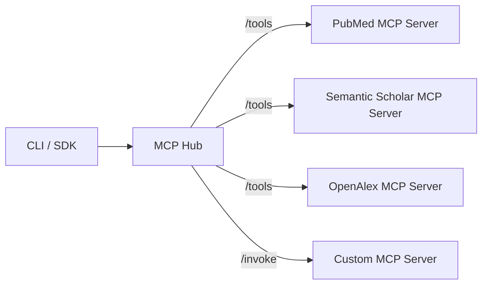

# MCP Hub Guide

## 概要

MCP (Model Context Protocol) Hub は複数の外部検索サーバーを統合し、JARVIS Research OS から統一されたツール実行インターフェースを提供します。
MCP Hub に登録されたサーバーはツール検出 (`/tools`) とツール実行 (`/invoke`) を提供し、CLI と API の両方から利用できます。

## アーキテクチャ図



## 設定ファイルの書き方

MCP サーバーは JSON 設定ファイルで登録します。`mcpServers` にサーバー名をキーとして定義します。

```json
{
  "mcpServers": {
    "pubmed": {
      "serverUrl": "https://mcp.pubmed.example",
      "type": "http",
      "requests_per_minute": 60,
      "headers": {
        "Authorization": "Bearer <token>"
      }
    }
  }
}
```

`requests_per_minute` を設定すると MCP Hub 側で簡易レートリミットが有効になります。

## 組み込みサーバーの使用方法

### PubMed

```bash
jarvis mcp register configs/mcp/pubmed.json
jarvis mcp tools --server pubmed
jarvis mcp invoke --tool search_pubmed --params '{"query": "cancer"}'
```

### Semantic Scholar

```bash
jarvis mcp register configs/mcp/semantic_scholar.json
jarvis mcp invoke --tool search_semantic_scholar --params '{"query": "clinical trial"}'
```

### OpenAlex

```bash
jarvis mcp register configs/mcp/openalex.json
jarvis mcp invoke --tool search_openalex --params '{"query": "meta analysis"}'
```

## カスタムサーバーの追加方法

1. `/tools` と `/invoke` エンドポイントを持つ MCP サーバーを用意します。
2. 設定ファイルにサーバー情報を追加します。
3. `jarvis mcp register` で登録します。

```json
{
  "mcpServers": {
    "custom": {
      "serverUrl": "https://custom-mcp.example",
      "type": "http",
      "tools": [
        {
          "name": "custom_search",
          "description": "Search internal dataset",
          "parameters": {"query": "string"},
          "required_params": ["query"],
          "enabled": true
        }
      ]
    }
  }
}
```

## CLI コマンドリファレンス

- `jarvis mcp register <config.json>`: MCP サーバー設定を登録
- `jarvis mcp servers`: 登録済みサーバーの一覧
- `jarvis mcp tools --server <name>`: サーバーのツール一覧
- `jarvis mcp invoke --tool <tool> --params '<json>'`: ツール実行

## トラブルシューティング

- **ツールが見つからない**: `jarvis mcp tools` でツールが登録されているか確認してください。
- **rate limit exceeded**: 設定の `requests_per_minute` を見直し、連続実行を控えてください。
- **接続エラー**: サーバー URL と認証ヘッダーが正しいか確認してください。
