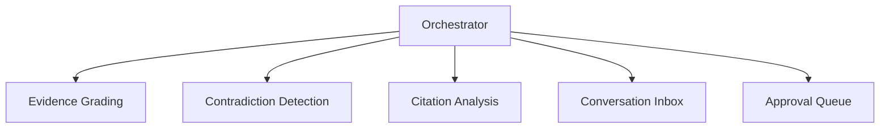

# Multi-Agent Orchestrator Guide

## 概要とアーキテクチャ図

Multi-Agent Orchestrator は複数のエージェントを同時に実行し、タスク分割・承認フロー・通知を一元管理します。



## エージェントの生成と管理

```python
from jarvis_core.orchestrator.orchestrator import Orchestrator
from jarvis_core.orchestrator.agent import AgentSpec

orchestrator = Orchestrator()
orchestrator.register_agent(AgentSpec(name="evidence"))
```

## 会話（Inbox）の使用方法

Inbox はエージェント間のメッセージングチャネルです。

```python
conversation = orchestrator.create_conversation("review-001")
conversation.add_message(role="agent", content="Start evidence grading")
```

## 承認フローの説明

承認が必要なアクションは `ApprovalQueue` に入り、承認された後に実行されます。

```python
approval = orchestrator.request_approval(
    action="run_external_tool",
    payload={"tool": "mcp.search"},
)
```

## API リファレンス

- `Orchestrator.register_agent(spec)`
- `Orchestrator.run_agents()`
- `Orchestrator.create_conversation(topic)`
- `Orchestrator.request_approval(action, payload)`
