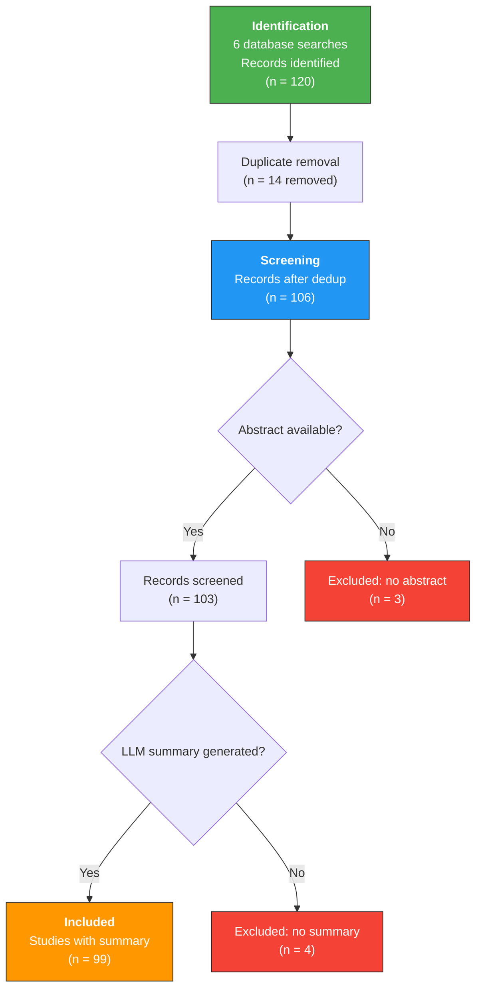

# PRISMA 2020 Flow Diagram

**Generated:** 2026-02-27 20:28 UTC
**Generated by:** JARVIS Research OS

---

## Flow Diagram

---

## Search Details

| Search | Papers Found |
|---|---|
| PD-1_immunotherapy_20260228_041919 | 20 |
| PD-1_checkpoint_inhibitor_resi_20260228_042531 | 20 |
| anti-PD-1_cancer_clinical_tria_20260228_043419 | 20 |
| PD-1_resistance_mechanism_tumo_20260228_043933 | 20 |
| PD-1_combination_therapy_effic_20260228_044441 | 20 |
| PD-L1_expression_biomarker_imm_20260228_045027 | 20 |

---

## Summary Statistics

| Stage | Count |
|---|---|
| Identified (total) | 120 |
| Duplicates removed | 14 |
| After deduplication | 106 |
| Excluded (no abstract) | 3 |
| After screening | 103 |
| Excluded (no summary) | 4 |
| **Included** | **99** |

---

*Generated by JARVIS Research OS on 2026-02-27 20:28 UTC*