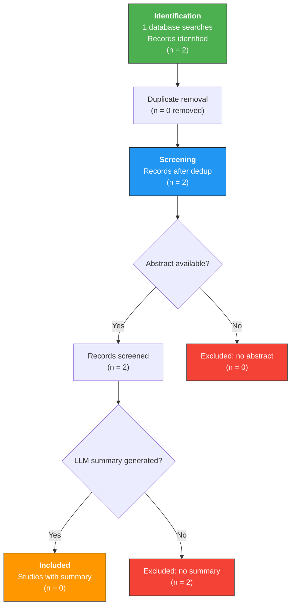

# PRISMA 2020 Flow Diagram

**Generated:** 2026-03-03 17:13 UTC
**Generated by:** JARVIS Research OS

---

## Flow Diagram

---

## Search Details

| Search | Papers Found |
|---|---|
| _smoke_sample | 2 |

---

## Summary Statistics

| Stage | Count |
|---|---|
| Identified (total) | 2 |
| Duplicates removed | 0 |
| After deduplication | 2 |
| Excluded (no abstract) | 0 |
| After screening | 2 |
| Excluded (no summary) | 2 |
| **Included** | **0** |

---

*Generated by JARVIS Research OS on 2026-03-03 17:13 UTC*